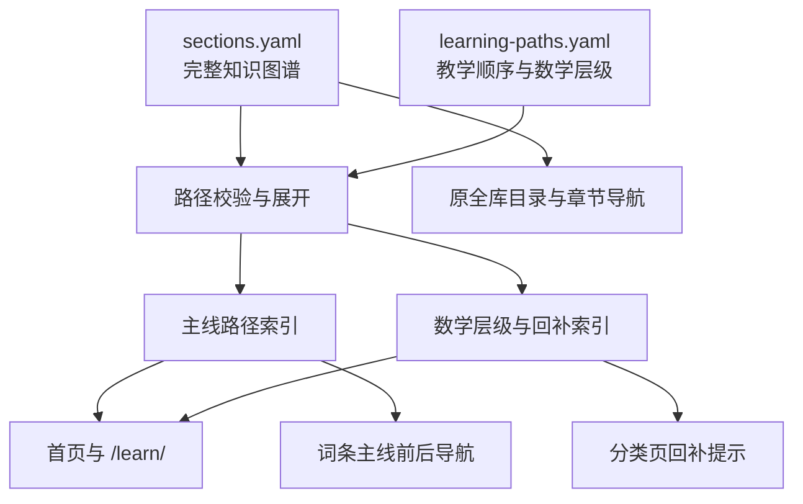
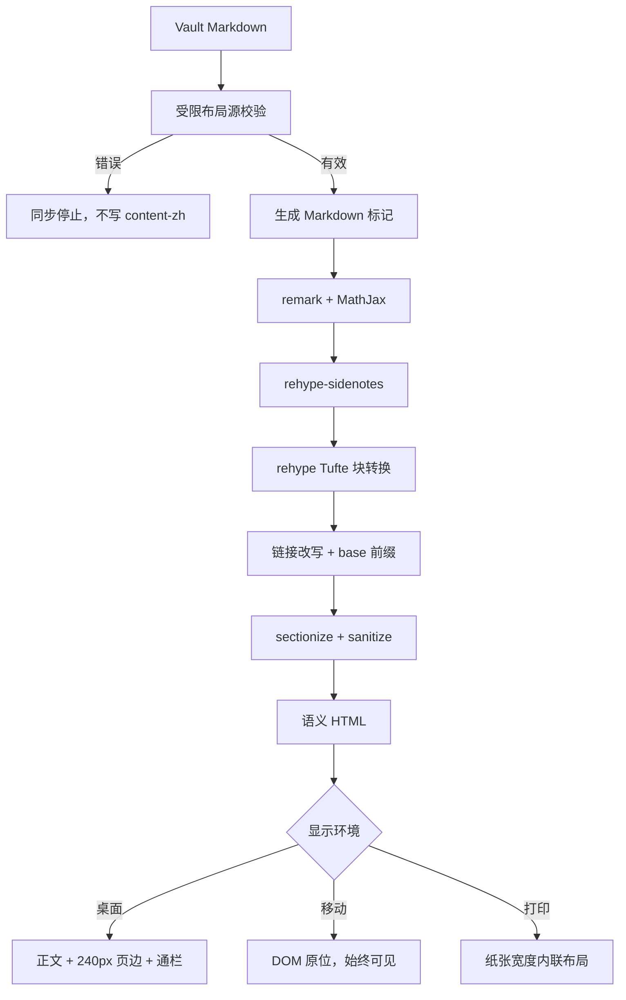

# Learning Paths and Tufte Teaching Features - Plan

## Goal Capsule

- **目标：** 把当前知识库从“必须先连续读完 94 篇数学词条”改为“先完成 17 篇最小数学前置，再沿主线学习，并在需要时回补数学”。
- **教学版式：** 扩展现有 Tufte 旁注能力，使页边图、通栏图表、题记和开篇短语服务于前置知识、局部直觉、证据与章节节奏。
- **内容权限：** 保留现有 7 部分、25 章、308 个 slug、正文位置和 vault 单一事实源。本计划不撰写新词条。
- **执行类型：** Deep。工作跨越大纲数据、导航、同步校验、Markdown AST、样式、可访问性、打印和内容试点。
- **停止条件：** 不导入 Tufte CSS 主题资产。不把必要定义或推导移入页边。不直接修改 `content-zh/`。不自动发布。
- **尾部责任：** 实施者负责同步、单元测试、构建、浏览器矩阵、打印检查和 QA 记录。提交、推送与发布仍需单独授权。
- **未解决阻塞项：** 无。

---

## Product Contract

### Summary

站点增加一条面向数学基础待复习读者的“第一遍主线”。主线先提供 17 篇最小数学前置，再进入机器学习、神经网络、Transformer 和现代 LLM。其余数学词条分为按需回补与进阶参考，不再构成进入机器学习的统一门槛。

全库目录继续承载完整知识结构。新学习路径只改变读者入口、导航顺序和学习提示，不改变大纲事实、词条 slug 或正文归属。

现有编号旁注和无编号边注继续使用。新增页边图、通栏图表、题记和开篇短语。每种能力都有固定教学职责、移动端行为、打印行为和作者语法。

### Problem Frame

`sections.yaml` 把 Part 0 的 94 篇数学词条放在全部机器学习内容之前。这个顺序适合作为依赖完整的知识图谱，但首页把它呈现为唯一学习顺序。数学基础待复习的读者需要先承受 94 篇连续数学内容，才能到达“模型如何学习”的反馈闭环。

当前导航也只有章节内“下一篇”。站点不能表达“第一遍先读什么”“当前数学是否为必要前置”“卡住时回补哪组内容”和“经典架构是否为可选支线”。

现有 Tufte 旁注已经解决局部补充信息的页边呈现。文章仍缺少适合小型插图、宽图表、章节题记和开篇短语的受控语义。直接复制 Tufte CSS 会覆盖项目自己的纸墨主题、移动端始终可见决策和可访问性合同。

### Key Decisions

- **双层学习结构** (session-settled: user-approved — chosen over 94 篇数学全部先行: 先形成模型学习闭环，再按当前问题回补数学)。Governs R1-R8.
- **完整大纲与学习路径分离** (session-settled: user-approved — chosen over 重排现有章节和 slug: 保留知识图谱稳定性，并为初学者增加独立入口)。Governs R2-R8, R19.
- **把 Tufte 能力作为教学语义，不作为整站主题** (session-settled: user-approved — chosen over 导入整套 Tufte CSS: 保留现有视觉身份、移动端行为和内容管线)。Governs R14-R23.
- **必要知识保留在正文或结构化学习路径** (session-settled: user-approved — chosen over 用旁注承载前置要求: 删除页边内容后主论证仍完整)。Governs R5, R15-R18.

### Requirements

#### 学习层级与大纲稳定性

- R1. 第一遍主线必须以附录 A 的 17 篇“最小数学前置”开始，不得要求读者先完成全部 Part 0。
- R2. 94 篇数学词条必须且只能属于“最小数学前置”“按需回补”或“进阶参考”中的一类。
- R3. 按需回补必须按“线性模型”“反向传播与训练”“Transformer”三个使用场景分组，并明确它们不是进入下一阶段的阻塞条件。
- R4. 第一遍主线必须按“最小数学前置 → 机器学习基础 → 神经网络 → Transformer → GPT 与现代 LLM”推进；经典架构必须作为 Transformer 前的可选支线；进阶理论必须保持参考轨。
- R5. 学习路径提示必须说明三种动作：“现在读”“遇到当前推导困难时回补”“按兴趣参考”。提示不得把建议误写为完成门槛。
- R6. 全库目录必须继续显示 7 部分、25 章、308 个 slug 及完成状态。学习路径不得替代或删减全库目录。
- R7. 学习路径引用的每个 slug 和 section 必须在 `sections.yaml` 中存在；数学层级必须完整覆盖 Part 0；重复、未知和遗漏引用必须使测试或构建失败。
- R8. 现有章节、slug、词条文件位置、`known_absent` 语义和章节内顺序必须保持不变。

#### 阅读入口与导航

- R9. 首页必须提供明确的“从这里开始”入口，同时保留全库目录作为完整参考入口。
- R10. 独立学习路径页必须显示主线阶段、每阶段目标、预计内容量、可选支线、按需数学回补和进阶参考入口。
- R11. 主线词条必须显示主线前后篇和阶段归属；可选支线词条必须显示支线前后篇和返回主线的稳定入口；目录专用词条必须继续使用现有章节导航。
- R12. 分类页必须显示该章在第一遍主线中的角色，以及对应的按需数学回补组；没有回补组时不得显示空提示。
- R13. 导航必须使用稳定 URL 和服务端生成的链接，不得依赖 query 参数、localStorage 或客户端历史来判断下一篇。
- R24. 按需回补词条必须显示其适用阶段的稳定返回链接；一个词条服务多个阶段时必须列出全部适用阶段，不猜测读者的来源页面。
- R25. 最小数学前置必须按线性代数、微积分、概率、信息论和优化五个小组显示；每篇必须说明“现在为什么需要”，并把阅读目标限制为定义、数字例子和首次机器学习用途，复杂证明允许后续回看。

#### Tufte 教学能力

- R14. 编号旁注和无编号边注必须保持现有作者语法、DOM 顺序、桌面 240 px 页边、移动端始终可见、键盘往返和密度警告合同。
- R15. 页边图必须承载紧邻正文的小型辅助图。作者必须提供非空替代文本，可提供一行图注；桌面端进入页边，移动端和打印时进入正文流。
- R16. 通栏图表必须只用于 680 px 正文列无法清晰容纳的核心图或表。桌面端可使用正文与页边总宽，窄屏和打印时不得产生页面级横向溢出。
- R17. 题记必须用于学习路径页或章节开场的短引文与来源。开篇短语必须用于学习路径阶段引导，不得替代词条的 `##` 分节结构。
- R18. 页边图、题记、开篇短语和通栏图表必须使用语义元素、现有主题变量和可读 DOM 顺序。删除这些呈现增强后，正文逻辑和学习路径仍必须完整。
- R19. vault 中的新布局语法必须在写入 `content-zh/` 前校验结构。无效结构必须产生带文件和行号的硬错误；密度或滥用风险必须进入非阻塞 lint。
- R20. 新布局必须覆盖浅色、黑色、桌面、移动端、打印和 reduced-motion 环境；本计划不得加入旁注折叠状态或布局 JavaScript。

#### 迁移与范围控制

- R21. 第一阶段必须在渲染试验田、学习路径页和至多两篇 vault 词条中试点新能力，不得批量改写 274 篇已完成词条。
- R22. 作者文档必须给出每种能力的用途、禁止内容、语法、移动端行为、打印行为和验收清单。
- R23. 站点不得复制 Tufte CSS 的字体、整套样式或 checkbox toggle。实现只采用其信息组织语义，并保持项目已有许可边界。

### Actors

- A1. **第一遍学习者：** 数学基础需要复习，希望尽快看到模型训练闭环，再回补当前需要的数学。
- A2. **查阅者：** 已知道目标概念，希望继续使用完整章节目录和稳定 slug 定位词条。
- A3. **作者：** 在 vault 编写词条，需要可预览、可校验且不会绕过同步边界的布局语法。
- A4. **维护者：** 修改大纲、路径或渲染管线，需要由测试发现引用漂移、DOM 退化和响应式问题。

### Key Flows

- F1. 第一遍学习者进入主线
  - **入口：** 首页“从这里开始”。
  - **步骤：** 打开学习路径页；查看五个主线阶段；从 17 篇最小数学前置开始；按主线前后导航推进。
  - **结果：** 学习者在进入机器学习之前只面对有限、明确的数学集合。
  - **覆盖：** R1, R4-R6, R9-R13.
- F2. 学习者按需回补数学
  - **入口：** 学习路径页、分类页或数学层级提示。
  - **步骤：** 识别当前场景的回补组；只打开正文当前引用或自己不熟悉的词条；返回原阶段继续学习。
  - **结果：** 回补保持可选，导航不会把整个回补组插入主线；词条提供返回适用阶段的稳定链接。
  - **覆盖：** R2, R3, R5, R10, R12, R13, R24.
- F3. 查阅者使用完整大纲
  - **入口：** 首页全库目录或章节页。
  - **步骤：** 按现有部分、章节和词条定位内容；使用章节内下一篇导航。
  - **结果：** 新学习路径不改变既有链接和查阅习惯。
  - **覆盖：** R6, R8, R11, R13.
- F4. 作者添加页边图或通栏图表
  - **入口：** vault 源词条。
  - **步骤：** 使用受限 callout；同步先校验结构和资源；Markdown 管线生成语义节点；CSS 决定桌面、移动与打印布局。
  - **结果：** 辅助图进入页边，真正宽内容使用通栏；无效语法在生成产物前失败。
  - **覆盖：** R15, R16, R18-R23.
- F5. 作者添加题记
  - **入口：** 学习路径页的站点数据或受限 vault callout。
  - **步骤：** 提供引文和来源；渲染器生成 blockquote 与 footer；移动端和打印保持连续阅读顺序。
  - **结果：** 题记与正文、普通引用块可区分，且不成为必要信息的唯一载体。
  - **覆盖：** R17-R23.
- F6. 路径或布局配置失效
  - **入口：** 未知 slug、数学分类遗漏、重复路径项、无 alt 页边图、混合型通栏 callout 或残留布局标记。
  - **步骤：** 数据校验、同步校验、AST 防御校验或 postbuild 检查报告具体位置。
  - **结果：** 失败显式发生，旧生成内容不被部分覆盖。
  - **覆盖：** R2, R7, R19, R21-R23.

### Acceptance Examples

- AE1. 最小数学前置
  - **覆盖：** R1-R5, R9, R10.
  - **Given：** 学习者第一次打开学习路径页。
  - **When：** 查看第一阶段。
  - **Then：** 页面显示 17 篇最小数学前置；其余 77 篇数学内容显示为按需回补或进阶参考；页面不要求先完成 94 篇。
- AE2. 数学分类完整性
  - **覆盖：** R2, R7.
  - **Given：** 从任一数学分组删除一个 slug，或把同一 slug 放入两个分组。
  - **When：** 运行路径数据测试。
  - **Then：** 测试失败并报告遗漏或重复的 slug 与分组。
- AE3. 主线与全库目录并存
  - **覆盖：** R4, R6, R8-R13.
  - **Given：** 一个同时位于原章节和第一遍主线的词条。
  - **When：** 从首页、学习路径页和章节页分别访问。
  - **Then：** slug 与正文相同；学习路径页提供主线前后关系；章节页仍按原章节顺序显示。
- AE4. 按需回补不阻塞
  - **覆盖：** R3, R5, R12.
  - **Given：** 学习者进入“反向传播”章。
  - **When：** 查看该章的数学提示。
  - **Then：** 页面把 Jacobian、向量链式法则等列为“遇到推导困难时回补”，并继续提供主线下一篇。
- AE10. 最小前置的阅读深度
  - **覆盖：** R1, R5, R10, R25.
  - **Given：** 学习者打开任一最小数学前置词条。
  - **When：** 从学习路径页查看该词条的“现在为什么需要”和阅读目标。
  - **Then：** 学习者能只完成定义、数字例子和首次机器学习用途后继续；页面不把完整证明或全部相关词条设为阶段门槛。
- AE5. 有效页边图
  - **覆盖：** R15, R18-R20.
  - **Given：** 一个带非空 alt 和短图注的 `marginfigure` callout。
  - **When：** 同一词条在桌面、移动端和打印环境渲染。
  - **Then：** 桌面图进入 240 px 页边；移动端和打印图进入正文流；三者使用同一内容和阅读顺序。
- AE6. 无效页边图
  - **覆盖：** R19.
  - **Given：** 一个页边图缺少图片、包含两张图片或图片 alt 为空。
  - **When：** 运行同步。
  - **Then：** 同步在写入生成产物前失败，并报告词条、callout 类型和行号。
- AE7. 通栏内容边界
  - **覆盖：** R16, R18-R20.
  - **Given：** 一个只含宽表格的 `fullwidth` callout。
  - **When：** 页面在 1440 px、390 px 和打印环境渲染。
  - **Then：** 桌面表格可使用正文与页边总宽；移动端只在表格容器内滚动；打印按页宽缩放或分页；页面根节点无横向溢出。
- AE8. 题记与普通引用块
  - **覆盖：** R17-R19.
  - **Given：** 同一篇内容包含一个题记和一个普通 blockquote。
  - **When：** Markdown 管线渲染。
  - **Then：** 题记具有引文和来源语义；普通 blockquote 保持现有输出；两者不会互相匹配。
- AE9. 删除增强内容
  - **覆盖：** R5, R18, R21.
  - **Given：** 从试点词条移除全部旁注、页边图、题记和通栏包装。
  - **When：** 重新阅读全文和学习路径。
  - **Then：** 定义、推导、训练协议、结论和主线导航仍完整。

### Success Criteria

- 第一遍主线的首个数学阶段固定为 17 篇，且页面明确显示“17 / 94”。
- 17 篇最小前置都有一个可验证的首次主线用途和一条有限阅读目标。
- 94 篇数学词条分类覆盖率为 100%，重复率为 0%。
- 现有 308 个大纲 slug、25 章和 7 部分保持不变。
- 无旁注页面和现有两篇旁注试点的渲染结构无非预期差异。
- 新布局在 1440 × 1000、390 × 844、浅色、黑色和打印环境下无页面级横向溢出。
- `npm run sync`、`npm test`、`npm run build` 和 `git diff --check` 全部通过。

### Scope Boundaries

- 不新增或撰写 prompting、in-context learning、test-time compute、RAG、工具调用、评估或安全词条。
- 不移动 `llama2-from-scratch`，不重排 `sections.yaml` 的既有章节与 entries。
- 不把生成模型从 Part 6 移出；该信息架构调整需要独立计划。
- 不批量回填 274 篇已完成词条的旁注或新 Tufte 语法。
- 不建立学习进度账号、完成勾选、持久状态、搜索排序或个性化推荐。
- 不导入 Tufte CSS、ET Book 字体或官方 checkbox 移动端交互。
- 不允许原始 HTML 进入 vault Markdown。
- 不改变 Part 0 数学词条不含代码的规则。

### Dependencies and Assumptions

- `sections.yaml` 继续是完整大纲和 slug 库存的唯一 repo 事实源。
- vault 继续是词条正文和正文插图的唯一事实源。
- `content-zh/` 继续是同步产物。
- 现有 34 个 `known_absent` 全部位于进阶理论，第一遍主线不会链接到缺失正文。
- 现有 `rehype-sidenotes`、共享 Markdown 管线和 sanitize 扩展可作为新增布局节点的实现模式。
- 学习路径是编辑决定，不从正文交叉链接自动推断。

### Sources and Research

- 当前大纲与顺序：`sections.yaml`。
- 当前学习入口：`src/pages/index.astro`、`src/pages/category/[section]/index.astro`、`src/pages/[slug].astro`。
- 当前旁注合同：`plans/2026-08-06-002-feat-tufte-sidenotes-plan.md`、`docs/authoring/sidenotes.md`、`docs/qa/2026-08-06-sidenotes-review.md`。
- 当前同步与渲染模式：`scripts/lib/sidenote-source.mjs`、`src/plugins/rehype-sidenotes.mjs`、`src/lib/markdown-pipeline.mjs`。
- Tufte CSS 官方示例与实现：[Tufte CSS](https://edwardtufte.github.io/tufte-css/)、[官方示例源码](https://github.com/edwardtufte/tufte-css/blob/gh-pages/index.html)、[官方 CSS 源码](https://github.com/edwardtufte/tufte-css/blob/gh-pages/tufte.css)。官方说明明确把网页实现视为可调整的起点，并区分 sidenote、marginnote、margin figure、fullwidth、epigraph 与 newthought。
- 本仓库没有 `CONTEXT.md`、`CONCEPTS.md` 或 `solutions/`。本计划只使用当前源码、项目文档、既有计划和官方资料。

---

## Planning Contract

### Product Contract Preservation

Product Contract unchanged.

### Key Technical Decisions

- KTD1. **使用独立 `learning-paths.yaml` 表达教学路径。** `sections.yaml` 继续拥有大纲、章节顺序、entries 和 `known_absent`；新文件只引用 section ID 与 slug。该选择落实 R1-R13，并避免把“知识归属”和“第一遍阅读顺序”混为同一字段。(session-settled: user-approved — chosen over 重排 sections.yaml: 保留 308 个词条的稳定知识图谱)
- KTD2. **路径解析器统一展开、校验和导航。** `src/lib/learning-paths.mjs` 读取两个 YAML 文件，按 `sections.yaml` 顺序展开整章选择器，生成数学层级索引、主线路径、可选支线、反向适用阶段和前后关系。页面不得各自解释 YAML。该选择落实 R2, R4, R7, R11-R13, R24。
- KTD3. **第一遍主线使用稳定的编辑顺序。** 主线包含 17 篇最小数学前置、Part 1、Part 2、Part 4 和 Part 5；Part 3 作为可选支线；Part 6 作为参考轨。每篇最小前置必须指向首次主线用途。按需数学组只提供链接，不插入主线前后关系。该选择落实 R1-R5, R11, R25。
- KTD4. **文章导航由内容成员关系决定。** 主线、可选支线和目录专用词条使用三种确定模式。按需回补词条在章节导航之外显示适用阶段入口。链接不携带阅读模式状态。该选择落实 R11-R13, R24，并避免刷新、分享或静态构建后导航含义变化。
- KTD5. **复用受限 callout 作为块级作者语法。** `marginfigure`、`fullwidth` 和 `epigraph` 在 vault 中保持 Obsidian 可见；同步层验证其结构并保留可识别标记。`newthought` 第一阶段只由学习路径页组件生成，不增加词条内行内 DSL。该选择落实 R15-R19, R22。(session-settled: user-approved — chosen over 原始 HTML 或全新行内 DSL: 保留 vault 可读性与同步控制)
- KTD6. **旁注插件保持稳定，新建块级 Tufte AST 插件。** `rehype-sidenotes` 继续只负责脚注与 `marginnote`；新插件负责页边图、通栏图表和题记。两者使用共享 Markdown 管线，并在链接改写、base 前缀、sectionize 和 sanitize 之前生成语义节点。该选择落实 R14-R19。
- KTD7. **采用项目版响应式合同。** 桌面页边图复用 240 px 页边；通栏内容使用正文与页边总宽；移动端所有内容回到 DOM 原位且始终可见；打印将页边内容内联并限制为纸张可用宽度。实现不复制官方 checkbox 行为。该选择落实 R14-R20, R23。(session-settled: user-approved — chosen over Tufte CSS 原始移动端折叠: 学习信息始终可见且无交互状态)
- KTD8. **Tufte 能力按教学职责治理。** 必要前置进入学习路径数据；局部补充进入旁注；辅助小图进入页边图；宽且必要的证据进入通栏；题记和开篇短语只负责节奏。源校验与 lint 阻止结构错误和明显滥用。该选择落实 R5, R15-R22。
- KTD9. **采用小规模迁移。** playground 覆盖全部布局状态；学习路径页使用题记和开篇短语；一篇数学词条试点页边图；一篇模型词条试点通栏表格或图。其他内容等待自然编辑。该选择落实 R21，并避免一次性产生不可审查的内容差异。

### Authoring Grammar

以下语法是实现合同，不是原始 HTML。同步层必须在普通 callout 降级之前识别。

页边图只允许一张图片和可选单行图注：

```markdown
> [!marginfigure] 图注
> 
```

通栏只允许“一张图片”或“一张表格”中的一种。标题可选：

```markdown
> [!fullwidth] 比较表
> | 条件 | 结果 | 解释 |
> | --- | --- | --- |
> | ... | ... | ... |
```

题记包含一段引文和一行来源：

```markdown
> [!epigraph]
> 引文正文。
>
> ——作者，《来源》
```

第一阶段不支持嵌套 callout、多个图片、图表混合、代码、展示数学、iframe 或原始 HTML。页边图可使用行内数学图注；通栏表格继续使用现有 Markdown 数学与横向滚动合同。

### Learning Path Data Shape

`learning-paths.yaml` 包含三个独立概念：

1. `math_layers`：附录 A 的 17 / 56 / 21 完整分区，以及 17 篇最小前置的 `why_now_zh` 与首次主线用途。
2. `paths`：第一遍主线的阶段和可选支线。阶段可引用显式 entries 或完整 sections。
3. `backfill_for_sections`：章节到按需数学组的提示映射。

section 选择器在解析时按 `sections.yaml` 展开。显式 entry 只用于 17 篇最小数学前置。路径文件不得复制词条标题、章节名称、完成状态或正文链接。

### High-Level Technical Design

学习路径与完整大纲共用 slug，但拥有不同顺序：



Tufte 内容只保留一条从 vault 到浏览器的语义链路：



### Sequencing

1. 先落地学习路径数据合同和完整性测试。
2. 再实现学习路径页、首页入口和稳定导航。
3. 然后扩展 vault 源校验与 Markdown AST。
4. DOM 合同稳定后实现桌面、移动和打印样式。
5. 最后加入 playground 与两篇真实词条试点，并执行完整 QA。

学习路径功能不依赖新 Tufte 块语法。两条工作流可以分别验证，但在最终 QA 和作者文档阶段汇合。

### System-Wide Impact

- **大纲边界：** `sections.yaml` 继续拥有内容库存。任何学习路径引用都必须反向校验到该库存。
- **导航边界：** 首页、学习路径页、分类页和词条页消费同一个路径解析结果。搜索、词汇表和站点 URL 不变。
- **作者边界：** vault 增加三个受限块级 callout。原脚注和 `marginnote` 合同不变。
- **同步边界：** 布局源校验加入全词条原子写入之前。普通 callout 继续按现有规则降级。
- **渲染边界：** Astro 构建与测试渲染继续共用 `createArticleMarkdownPipeline`。新节点必须进入 sanitize 白名单。
- **资源边界：** 页边图继续使用现有 SVG 归属、存在性和双主题颜色合同。通栏图不引入新的资源类型。
- **版式边界：** 680 px 正文和 240 px 页边保持不变。只有显式通栏节点可跨越正文宽度。
- **可访问性边界：** DOM 顺序是桌面、移动和打印的共同语义顺序。视觉浮动不得改变辅助技术的阅读顺序。
- **发布边界：** 本计划只规定本地验证。公开发布仍受 `check:public-history`、`check:public-release` 和用户授权约束。

### Risks and Dependencies

- **路径与大纲漂移：** 新增或移动 slug 后路径可能失效。R7 的完整性测试和 postbuild 引用检查必须阻止漂移。
- **双导航歧义：** 主线导航和章节导航同时成为主要动作会增加认知负担。KTD4 规定按成员关系选择一种前后导航，面包屑始终保留章节归属。
- **回补与支线无法返回：** 无状态 URL 不能记住来源页面。路径解析器必须生成确定的反向阶段入口和支线收束入口，不能把浏览器返回键当作产品流程。
- **数学回补再次变成门槛：** 页面如果使用“必须掌握”文案，会重建原问题。文案测试和 AE4 必须锁定“遇到困难时回补”。
- **浮动重叠：** 页边图与现有旁注可能争用同一列。CSS 必须让两者共享 `clear: right` 顺序，并覆盖同段旁注加页边图的 fixture。
- **通栏破坏 sectionize 清除：** 通栏节点跨宽后可能覆盖下一节。每个 `article-section` 的清除合同和通栏自身清除规则必须同时测试。
- **打印退化：** 当前 `@media print` 只隐藏导航并设置纸色。新增内容需要单独的打印合同，不能从桌面浮动规则推断。
- **源解析复杂度：** 通栏表格是多行块结构。解析器必须识别 fenced code、表格分隔行、空引用行和 callout 终点，不能只用单行替换。
- **生成产物误改：** 两篇试点必须先改 vault，再同步。`content-zh/` 只用于审查生成差异。
- **回退顺序：** 新布局语法一旦进入 vault，不能先删除 AST 插件。回退必须先把试点 callout 转回普通图表并同步，再撤销插件与样式；学习路径可独立移除入口和数据文件。
- **外部风格误用：** Tufte CSS 官方明确把实现视为起点。KTD5-KTD8 绑定本项目差异，防止实施者复制官方主题或隐藏式移动旁注。

---

## Implementation Units

### U1. 建立学习路径数据合同与完整性校验

- **Goal:** 用独立数据文件表达第一遍主线、数学层级、可选支线和章节回补映射，并生成唯一的解析结果。
- **Requirements:** R1-R8, R13, R25；F1-F3, F6；AE1-AE4, AE10；KTD1-KTD3。
- **Dependencies:** 无。
- **Files:** `learning-paths.yaml`, `src/lib/learning-paths.mjs`, `src/lib/sections.mjs`, `tests/unit/learning-paths.test.mjs`, `tests/unit/content-inventory.test.mjs`。
- **Approach:**
  1. 按附录 A 写入 94 篇数学词条的互斥分区。
  2. 用显式 entries 定义 17 篇最小数学前置，并为每篇记录“现在为什么需要”和首次主线用途；用 section 选择器定义后续主线阶段。
  3. 把 Part 3 定义为可选支线，把 Part 6 定义为参考轨，不加入主线前后关系。
  4. 集中解析两个 YAML，生成按 slug 查询的层级、阶段、前一篇、下一篇和回补组。
  5. 校验未知 section、未知 slug、重复主线项、数学分区重叠、数学分区遗漏和缺失主线正文。
- **Patterns to follow:** `src/lib/sections.mjs` 的 YAML 读取；`tests/unit/content-inventory.test.mjs` 的 slug 库存与 `known_absent` 精确一致检查。
- **Test scenarios:**
  - Covers AE1. 主线第一阶段精确展开为附录 A 的 17 个 slug。
  - Covers AE2. 删除、重复或拼错任一数学 slug 时，错误包含 slug 与冲突分组。
  - section 选择器按 `sections.yaml` 的 entries 顺序展开，不能按文件系统或字母顺序展开。
  - 主线不包含 Part 3 与 Part 6；可选支线包含 Part 3；参考轨包含 Part 6。
  - 主线中的每个 slug 都有生成词条；`known_absent` 只允许出现在参考轨。
  - 17 / 56 / 21 三类计数与 94 篇总数一致。
  - 17 篇最小前置全部具有非空用途说明，且首次用途指向主线内有效 slug。
- **Verification:** 单元测试报告确定的展开顺序和数学分区；现有内容库存测试继续通过。

### U2. 增加学习路径页与首页入口

- **Goal:** 让第一遍学习者在一个稳定页面理解学习阶段、数学层级、可选支线和回补动作。
- **Requirements:** R4-R6, R9, R10, R13, R17, R18, R25；F1-F3；AE1, AE3, AE4, AE10；KTD2-KTD5。
- **Dependencies:** U1。
- **Files:** `src/pages/learn.astro`, `src/pages/index.astro`, `src/layouts/BaseLayout.astro`, `src/styles/site.css`, `tests/unit/visual-contracts.test.mjs`, `tests/unit/learning-paths.test.mjs`。
- **Approach:**
  1. 在首页 hero 增加主动作“从这里开始”，并把全库目录保留为并列的参考入口。
  2. 学习路径页按五个主线阶段呈现目标、数量、完成状态和下一动作。
  3. 在数学阶段显示 17 / 94，并把 17 篇按五个数学小组展开；每篇显示“现在为什么需要”和有限阅读目标。
  4. 把三个回补组与 21 篇进阶参考放入原生 `details` 层级；summary 必须可聚焦，关闭状态不得隐藏组别含义，打印时必须展开全部内容。
  5. 把经典架构显示为 Transformer 前的可选支线，不计入主线进度。
  6. 在页首使用一个题记，在每个阶段引导段使用开篇短语；不把开篇短语用于词条 H2。
- **Patterns to follow:** `src/pages/index.astro` 的服务端数据加载与 `withBase()`；`src/pages/category/[section]/index.astro` 的完成/TODO 显示；现有纸墨变量。
- **Test scenarios:**
  - Covers AE1. 页面显示 17 篇最小数学前置、56 篇按需回补、21 篇进阶参考。
  - Covers AE3. 主线链接与全库目录链接解析到同一 slug URL。
  - Covers AE4. 回补组使用“遇到推导困难时回补”，不使用“完成后解锁”或等价门槛文案。
  - Covers AE10. 17 篇都显示首次用途与有限阅读目标；缺少任一字段时页面数据测试失败。
  - 缺失参考词条显示 TODO，但第一遍主线不产生不可点击的下一篇。
  - 题记使用 blockquote 与来源语义；开篇短语不会替代 H2 或出现在每个普通段落。
  - 页面在禁用 JavaScript 时仍能访问全部路径链接。
- **Verification:** Astro 结构测试与浏览器检查证明双入口、阶段顺序和无状态链接成立。

### U3. 把路径角色接入分类页和词条导航

- **Goal:** 在不改变 URL 与章节归属的前提下，为主线成员提供稳定前后导航，为章节提供按需数学提示。
- **Requirements:** R3-R5, R8, R11-R13, R24；F1-F3；AE3, AE4；KTD2-KTD4。
- **Dependencies:** U1。
- **Files:** `src/lib/article-navigation.mjs`, `src/pages/[slug].astro`, `src/pages/category/[section]/index.astro`, `src/styles/site.css`, `tests/unit/article-navigation.test.mjs`, `tests/unit/render-page-structure.test.mjs`, `tests/unit/visual-contracts.test.mjs`。
- **Approach:**
  1. 扩展导航辅助函数，使它接收解析后的路径索引并返回主线、可选支线或目录专用三种模式。
  2. 主线成员在 article meta 显示阶段和数学层级，在 footer 显示主线前后篇。
  3. 目录专用词条保持章节内下一篇；面包屑与返回本章目录始终保留。
  4. 可选支线末尾显示返回 Transformer 阶段的稳定入口。
  5. 分类页按 `backfill_for_sections` 显示对应数学组，并使用非阻塞说明。
  6. Part 0 词条显示“最小前置 / 按需回补 / 进阶参考”之一；按需回补词条列出全部适用阶段入口。
- **Patterns to follow:** 当前 `getNextAvailableSlug` 的纯函数测试；article meta 和 chapter-nav 的无客户端状态实现。
- **Test scenarios:**
  - Covers AE3. 同一主线词条从任意入口打开时，前后关系一致且 URL 无 query 参数。
  - 主线阶段边界的上一/下一篇跨 section 正确连接。
  - 可选支线使用支线导航，并在末尾返回 Transformer；参考轨使用章节导航。
  - Covers AE4. 反向传播和训练章节显示对应回补组，且主线下一篇仍可用。
  - 从 Jacobian 等回补词条可直接返回“神经网络”阶段；服务多个阶段的数学词条显示多个入口。
  - 未完成词条被主线导航跳过或在数据校验阶段拒绝，不能产生死链。
- **Verification:** 纯函数测试覆盖主线中段、阶段边界、可选支线、参考轨和未知 slug；页面结构测试锁定显示条件。

### U4. 扩展 vault Tufte 源语法与原子同步校验

- **Goal:** 在任何生成产物写入前验证页边图、通栏图表和题记，并保持现有旁注与普通 callout 行为。
- **Requirements:** R14-R19, R21-R23；F4-F6；AE5-AE8；KTD5, KTD8, KTD9。
- **Dependencies:** 无。
- **Files:** `scripts/lib/article-layout-source.mjs`, `scripts/lib/sidenote-source.mjs`, `scripts/sync-from-vault.mjs`, `tests/unit/article-layout-source.test.mjs`, `tests/unit/sidenote-source.test.mjs`。
- **Approach:**
  1. 用一个布局源编排器先调用现有旁注校验，再识别三个新 callout，最后执行普通 callout 降级。
  2. 页边图要求一张图片、非空 alt、可选单行图注，并复用 SVG 路径归属检查。
  3. 通栏要求一张图片或一张矩形 Markdown 表格；混合内容、第二个块和空标题按合同处理。
  4. 题记要求一段引文和一行来源；普通 blockquote 保持不变。
  5. 在全部词条校验完成后才写 `content-zh/` 与资产，保持当前原子同步语义。
  6. 对通栏使用过多、题记出现在文章中段或页边图图注过长产生 lint；阈值写入作者文档并由测试锁定。
- **Execution note:** 不用正则跨越任意 Markdown 块。解析器按行跟踪围栏、callout 边界、空引用行和表格结构。
- **Patterns to follow:** `prepareSidenoteSource()` 的 errors/warnings/text 返回结构；同步脚本现有统一错误收集与先校验后写入顺序。
- **Test scenarios:**
  - Covers AE5. 单图页边图保留图片、alt 和图注标记。
  - Covers AE6. 缺图、双图、空 alt、展示数学、代码和嵌套 callout 分别失败。
  - Covers AE7. 单图通栏与矩形单表通栏通过；图表混合、多表和非矩形表失败。
  - Covers AE8. 单引文加来源通过；缺来源、多段引文和嵌套引用失败；普通 blockquote 输出不变。
  - 已有编号旁注、`marginnote`、普通 callout 和无布局词条输出不变。
  - 任一布局错误时，哨兵 `content-zh/` 产物与资产保持不变。
- **Verification:** 解析器单元测试覆盖每个结构分支；同步集成测试证明错误发生在写入前。

### U5. 生成语义 Tufte 节点并扩展 sanitize 合同

- **Goal:** 把受限布局标记转换为语义页边图、通栏图表和题记，同时保持链接、数学、SVG 和 sectionize 管线一致。
- **Requirements:** R14-R20, R23；F4-F6；AE5-AE8；KTD5-KTD7。
- **Dependencies:** U4。
- **Files:** `src/plugins/rehype-tufte-blocks.mjs`, `src/lib/markdown-pipeline.mjs`, `src/plugins/rehype-sidenotes.mjs`, `tests/unit/rehype-tufte-blocks.test.mjs`, `tests/unit/rehype-sidenotes.test.mjs`, `tests/unit/render-page-structure.test.mjs`。
- **Approach:**
  1. 新插件只匹配同步层保留的精确 callout 标记，异常 HAST 结构显式失败。
  2. 页边图生成 `figure`、`img` 与 `figcaption`；通栏图生成 `figure.fullwidth`，通栏表生成语义容器与原生 table；题记生成带来源 footer 的 blockquote。
  3. 插件在旁注之后、链接改写之前运行，使内部链接和 base 前缀继续经过现有管线。
  4. 扩展 sanitize 白名单，只放行插件生成的 `figure`、`figcaption`、`footer`、必要类名和 ARIA 属性。
  5. sectionize 保持 H2 三级结构；通栏和题记作为所属 section 的子节点。
- **Patterns to follow:** `src/plugins/rehype-sidenotes.mjs` 的单职责 HAST 遍历、结构防御与无 raw HTML 设计；`makeMarkdownSanitizeSchema()` 的集中白名单。
- **Test scenarios:**
  - Covers AE5. 页边图节点的 DOM 顺序为引用段后 figure，alt 与图注保留。
  - Covers AE7. 通栏图和通栏表具有不同类名，但共享 fullwidth 布局合同。
  - Covers AE8. 题记使用 blockquote/footer，普通 blockquote 不带题记类名。
  - 旁注与页边图同段出现时，插件顺序不改变旁注 ID、ARIA 与返回链接。
  - 站内链接经过 rewrite 和 base 前缀；行内数学经过 MathJax；未授权属性被 sanitize 移除。
  - 异常标记绕过源校验进入 HAST 时，插件失败而不是降级为普通引用。
- **Verification:** 测试辅助渲染与 Astro 生产入口对同一 fixture 生成相同 DOM；现有旁注测试无回归。

### U6. 实现桌面、移动端和打印版式

- **Goal:** 让新增节点在现有 680 px 正文与 240 px 页边中稳定呈现，并为打印建立独立合同。
- **Requirements:** R14-R20, R23；F4, F5；AE5, AE7-AE9；KTD7, KTD8。
- **Dependencies:** U5。
- **Files:** `src/styles/site.css`, `playground/rendering.md`, `public/assets/playground/svg/`, `tests/unit/visual-contracts.test.mjs`。
- **Approach:**
  1. 页边图与 `.sidenote` 在桌面共享右浮动、240 px 宽度和 `clear: right` 顺序。
  2. 通栏内容只在 1040 px 以上扩展到正文与页边总宽，并在前后清除浮动。
  3. 窄屏把页边图恢复为正文 figure，把通栏限制为 100%；宽表只允许容器内横向滚动。
  4. 打印取消全部浮动和负 margin；旁注与页边图内联；通栏图按纸宽缩放；表头可重复且避免无意义断行。
  5. 打印强制展开学习路径页的 `details` 内容，避免参考组在纸面消失。
  6. 题记控制长度、来源对齐和分页；开篇短语使用字重与字距建立节奏，但不模拟不存在的中文 small caps。
  7. playground 覆盖旁注加页边图竞争、宽图、宽表、题记、开篇短语、长图注、深色主题和打印。
  8. 同时覆盖首个 H2 之前的引言内容和 `article-section` 内部内容，避免 sectionize 的两种 DOM 位置使用不同布局合同。
- **Patterns to follow:** 当前 `@media (min-width: 1040px)` 旁注规则、移动端 MathJax/表格容器规则、主题变量和 `article-section::after` 清除合同。
- **Test scenarios:**
  - Covers AE5. 桌面页边图为 240 px，移动端宽度等于正文容器，打印无负 margin。
  - 同段两条旁注加一张页边图按 DOM 顺序向下排列，不覆盖下一节。
  - Covers AE7. 1440 px 下通栏使用扩展宽度；390 px 下根节点宽度等于 viewport；表格容器可横向滚动。
  - 浅色与黑色下图注、边界、链接和题记来源达到现有正文可读层级。
  - 打印预览中题记、图注、旁注正文和来源不被裁切；站点导航不进入打印。
  - `prefers-reduced-motion: reduce` 下没有新增布局动画。
- **Verification:** CSS 视觉契约锁定关键断点和打印覆盖；浏览器测量记录根节点、内容框、浮动顺序和滚动容器数值。

### U7. 写入小规模试点并完成文档与验收

- **Goal:** 用真实学习路径和有限内容证明教学职责、作者体验、正文自足性和完整验证合同。
- **Requirements:** R1-R25；F1-F6；AE1-AE10；KTD8, KTD9。
- **Dependencies:** U2, U3, U6。
- **Files:** `docs/authoring/sidenotes.md`, `docs/authoring/tufte-layout.md`, `docs/qa/2026-08-06-learning-path-tufte-review.md`, `README.md`, `PROJECT_MEMORY.md`, `tests/unit/tufte-pilots.test.mjs`。
- **External source set:** vault 的 `lengths-and-distances.md` 与 `mnist-mlp-training-loop.md`；对应 `content-zh/` 文件只能由同步生成。
- **Approach:**
  1. 在 `lengths-and-distances` 增加一张辅助性页边图，正文继续拥有距离定义与主要距离球图。
  2. 在 `mnist-mlp-training-loop` 把一张确实超过正文列的核心比较表或训练流程图设为通栏；若浏览器测量证明 680 px 已足够，则保留试点只在 playground，不为满足数量强行通栏。
  3. 学习路径页使用一个短题记和阶段开篇短语，验证它们不替代导航或 H2。
  4. 扩展旁注文档，新增布局文档，记录语法、职责、失败语义、移动端与打印行为。
  5. QA 记录首页、学习路径页、playground 和两篇候选词条的主题、视口、DOM、控制台、横向溢出、键盘与打印证据。
  6. 更新项目记忆时只追加本次确认事实，不覆盖实施开始前已有的无关修改。
- **Patterns to follow:** `docs/authoring/sidenotes.md` 的事实源边界；`docs/qa/2026-08-06-sidenotes-review.md` 的四象限测量；当前试点内容合同。
- **Test scenarios:**
  - Covers AE9. 删除两篇候选词条的新布局后，定义、推导、训练协议和结论仍完整。
  - 数学试点的页边图 alt、资源路径、SVG 双主题和图注通过全部静态检查。
  - 模型试点只有在 680 px 不足的测量证据成立时进入通栏；否则 QA 明确记录未采用。
  - 274 篇生成词条没有批量新增布局标记。
  - 作者可以根据文档区分旁注、页边图、通栏、题记与普通图表。
- **Verification:** 同步、测试、构建和浏览器/打印矩阵全部通过；QA 文档包含数值与明确的未验证边界。

---

## Verification Contract

### Automated Gates

从仓库根目录依次运行：

```bash
npm run sync
npm test
npm run build
git diff --check
```

验收结果必须满足：

- 同步报告的完成词条、插图和警告数量可解释；不得出现布局硬错误或静默跳过。
- `npm test` 覆盖路径数据、导航、源校验、HAST、sanitize、视觉合同和试点内容合同。
- build 的 postbuild 检查保持 `mjx-error=0`、插图引用可解析、内部链接可解析和 SVG 主题合同通过。
- 生成差异只来自获批的 vault 试点和路径 UI；`content-zh/` 没有手工修补痕迹。

### Browser Matrix

至少检查以下页面：

- `/`
- `/learn/`
- `/playground/`
- `/lengths-and-distances/`
- `/mnist-mlp-training-loop/`
- 一个不在第一遍主线的 Part 3 词条
- 一个 Part 6 TODO 所在分类页

每页执行以下组合：

| 环境 | 视口 / 输出 | 必查项 |
| --- | --- | --- |
| 浅色桌面 | 1440 × 1000 | 680 px 正文、240 px 页边、通栏宽度、浮动顺序、主线入口 |
| 黑色桌面 | 1440 × 1000 | 文字、图注、边界、焦点、SVG 双主题 |
| 浅色移动 | 390 × 844 | DOM 原位、始终可见、根节点无横向溢出、表格局部滚动 |
| 黑色移动 | 390 × 844 | 背景与文字层级、链接与焦点、无裁切 |
| 打印 | A4 或 Letter 预览 | 无浮动负 margin、图表适配、题记与来源、分页、隐藏站点导航 |

浏览器证据必须记录：

- 控制台 warning/error 数量。
- `documentElement.scrollWidth` 与 `clientWidth`。
- 页边节点的宽度、顺序和是否重叠。
- 通栏节点和内部滚动容器的宽度。
- 键盘聚焦顺序与可见焦点。
- 题记、figure、figcaption、table、blockquote/footer 的 DOM 语义。

### Regression Gates

- 现有 `lengths-and-distances` 与 `mnist-mlp-training-loop` 编号旁注和 `marginnote` 保持有效。
- 无布局词条、普通 blockquote、普通图、普通表格、MathJax、代码块和 sectionize 输出无非预期差异。
- 首页全库目录仍显示 7 部分、25 章和 308 个词条。
- 搜索、词汇表、base path 和 GitHub Pages 内部链接保持可解析。
- `check:public-history` 和 `check:public-release` 不属于本地功能完成条件，但任何后续发布前仍必须执行。

### Manual Quality Gates

- 由一名读者从首页进入主线，确认第一屏没有“先完成 94 篇数学”的含义。
- 由一名数学基础待复习的读者复述五个小组的阅读目标，并确认复杂证明可以后续回看。
- 从反向传播章节打开回补提示，确认读者可以继续主线而不完成整组回补。
- 移除试点增强内容后复读正文，确认主论证完整。
- 检查页边图和通栏是否确有版式必要；没有必要的实例必须撤回普通图表。

---

## Definition of Done

### Global

- R1-R25 均有实现单元和可观察验证结果。
- 94 篇数学词条按 17 / 56 / 21 完整且互斥分类。
- 第一遍主线、可选支线和参考轨可以从首页发现并使用。
- 原完整大纲、章节、slug、正文归属和 URL 不变。
- 新 Tufte 能力拥有源校验、AST、sanitize、响应式、打印、作者文档和 QA 证据。
- 现有旁注、普通 Markdown、MathJax、SVG、搜索和内部链接无回归。
- 所有自动闸与浏览器矩阵通过。
- 所有失败尝试、临时 fixture 和无用 CSS 已移除；不得把试验代码留在最终差异中。
- 未获得单独授权时，不提交、不推送、不发布。

### Per Unit

- **U1:** 路径解析器可证明数学分区、主线顺序和引用完整性。
- **U2:** 首页和学习路径页清楚区分主线与全库目录，并在无 JavaScript 时可用。
- **U3:** 主线成员与非主线成员获得确定且不冲突的导航。
- **U4:** 新作者语法在同步写入前完成结构校验，现有旁注与普通 callout 无回归。
- **U5:** 新布局生成语义、安全且管线一致的 HTML。
- **U6:** 桌面、移动和打印版式满足尺寸、顺序、溢出与可访问性合同。
- **U7:** 小规模试点、作者文档、QA 记录和项目记忆与最终实现一致。

---

## Appendix

### Appendix A. Math Layer Assignment

以下分区是 R1-R3 与 KTD3 的权威清单。实施时按原顺序写入 `learning-paths.yaml`。

#### 最小数学前置：17 篇

`vectors`, `matrices`, `matrix-multiplication`, `norms`, `derivatives`, `differentiation-rules`, `chain-rule`, `partial-derivatives`, `gradient`, `random-variables`, `expectation`, `variance-and-covariance`, `information-and-surprise`, `entropy`, `cross-entropy`, `optimization-problems`, `gradient-descent-theory`。

#### 按需回补：线性模型，27 篇

`linear-systems`, `gaussian-elimination`, `vector-spaces`, `subspaces`, `linear-combinations-and-span`, `linear-independence`, `basis`, `dimension`, `coordinates`, `linear-maps`, `kernel-and-image`, `rank`, `matrix-inverse`, `affine-spaces-and-maps`, `orthogonal-projections`, `pseudoinverse`, `gaussian-distribution`, `joint-distributions`, `marginal-and-conditional`, `bayes-theorem`, `independence`, `covariance-matrix`, `maximum-likelihood`, `maximum-a-posteriori`, `convex-sets-and-functions`, `local-and-global-minima`, `first-order-optimality`。

#### 按需回补：反向传播与训练，16 篇

`total-derivative`, `jacobian`, `vector-chain-rule`, `hessian`, `taylor-series`, `elementwise-derivatives`, `broadcast-and-reduction-derivatives`, `matrix-calculus-identities`, `numerical-differentiation`, `automatic-differentiation`, `stochastic-gradient-descent-theory`, `momentum-theory`, `adaptive-learning-rates`, `curvature-and-conditioning`, `loss-landscapes`, `saddle-points`。

#### 按需回补：Transformer，13 篇

`inner-products`, `lengths-and-distances`, `angles-and-orthogonality`, `orthonormal-basis`, `trace`, `eigenvalues-and-eigenvectors`, `eigendecomposition`, `spectral-theorem`, `quadratic-forms`, `svd`, `low-rank-approximation`, `matrix-norms`, `perplexity`。

#### 进阶参考：21 篇

`change-of-basis`, `rank-nullity`, `orthogonal-matrices-and-rotations`, `determinant`, `characteristic-polynomial`, `probability-spaces`, `discrete-distributions`, `continuous-distributions`, `law-of-large-numbers`, `central-limit-theorem`, `sampling`, `change-of-variables`, `exponential-family`, `concentration-inequalities`, `kl-divergence`, `conditional-entropy`, `mutual-information`, `second-order-optimality`, `second-order-methods`, `constrained-optimization`, `duality`。

### Appendix B. Deferred Outline Findings

以下发现来自本轮书目与当前大纲评估，但不进入本计划的实现范围：

- `llama2-from-scratch` 的内容角色更接近 decoder-only 实现收束，不是对齐概念。当前 slug 和章节位置保持不变；后续信息架构计划再决定是否移动。
- prompting、in-context learning、test-time compute、RAG、工具调用、LLM 评估和安全治理缺少独立章节。新增词条需要单独的书目与范围计划。
- 生成模型当前位于进阶理论参考轨。是否拆成独立部分需要单独决定，不能与本次阅读路径迁移混合。
