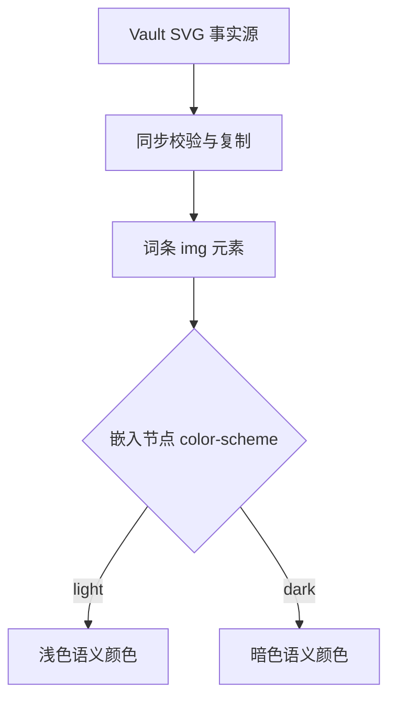
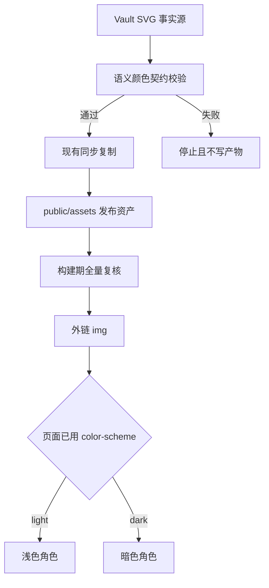
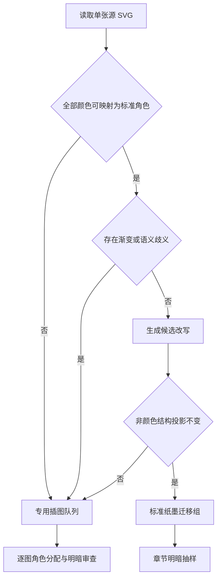

# Dark SVG Theme - Plan

## Goal Capsule

- **目标：** 让全部词条 SVG 在现有两种页面主题下保持可读，并且每张插图只保留一个源 SVG。
- **产品权限：** 本计划负责 SVG 主题行为、迁移、作者约束和验收。Tufte 旁注属于独立范围。
- **未解决阻塞项：** 无。

---

## Product Contract

### Summary

词条 SVG 将使用响应嵌入页面配色的内部语义颜色。工作范围包括建立颜色契约、分阶段迁移存量资产，以及阻止新的浅色专用插图进入站点。

### Problem Frame

页面主题能正确改变正文与 MathJax，但词条 SVG 仍使用写死的浅色主题颜色。墨线、坐标轴和标签在黑色页面上因此失去对比度。

现有资产包含 279 个 SVG 和 359 种十六进制颜色。多数文件共享一套小型纸墨颜色；热图、渐变和类别颜色需要逐图判断。

### Key Decisions

- **每张插图只保留一个自适应 SVG** (session-settled: user-directed — chosen over 明暗双文件与内联 SVG: 保留现有资产模型)。Governs R1, R7.
- **使用已确认的视觉层级** (session-settled: user-directed — chosen over 进一步弱化辅助元素与整体提亮: 在恢复信息的同时控制暗色主题噪声)。Governs R2, R3, R4.
- **分阶段迁移** (session-settled: user-directed — chosen over 一次性迁移与只约束新插图: 隔离专用配色异常)。Governs R9, R10.
- **分层视觉验收** (session-settled: user-directed — chosen over 全部标准图逐张验收与只跑静态检查: 平衡覆盖率和审查成本)。Governs R11, R12.

### Requirements

**主题行为**

- R1. 每张词条插图必须保持单一源 SVG，并根据嵌入节点的已用 `color-scheme` 切换内部颜色；切换页面主题不得要求刷新页面。
- R2. 标准纸墨插图必须在两种主题下保持以下层级：主墨线、说明文字、坐标轴、分隔线、装饰标记；珊瑚色只承担强调。
- R3. 标准纸墨插图必须使用下表基准颜色；专用插图只有在基准颜色无法表达信息时才可增加语义颜色角色。

| 角色 | 浅色 | 暗色 | 用途 |
|---|---:|---:|---|
| 页面背景 | `#faf9f5` | `#151515` | 周围纸张或透明画布 |
| 主墨线 | `#312f2f` | `#f0efe8` | 主线、点和主要标签 |
| 说明文字 | `#6c6a64` | `#aaa9a1` | 图注和次要标签 |
| 坐标轴 | `#b8b2a8` | `#8b8a83` | 坐标轴、辅助线和箭头标记 |
| 分隔线 | `#e1ddd7` | `#4f4f49` | 不承担信息的分区线 |
| 珊瑚文字 | `#a9583e` | `#dc896d` | 强调标签 |
| 珊瑚描边 | `#cc785c` | `#e28466` | 强调线、点和边界 |

- R4. 图内文字和文字图像相对背景的对比度必须至少为 4.5:1；理解内容所需的图形对象相对相邻颜色的对比度必须至少为 3:1。
- R5. 浅色纸张矩形必须改为透明或响应主题；只有浅色外观本身承载信息时才可保留。
- R6. 主题切换必须保留每个序列、类别、状态和标注的含义与相对显著性；当源图已使用形状、线型或标签时，迁移不得让颜色成为唯一提示。

**事实源与作者工作流**

- R7. vault SVG 继续作为唯一可编辑事实源；同步后的站点资产继续作为纯产物，禁止手工修改。
- R8. 新增和已迁移 SVG 必须为标准纸墨颜色使用已登记语义角色；专用颜色必须声明为该插图的语义角色，禁止用无说明的颜色字面量绕过校验。

**迁移**

- R9. 迁移必须按三个可独立验收的组推进：代表性试点、标准纸墨插图、包含热图、渐变或领域类别颜色的专用插图。
- R10. 只有一个源颜色具有一个已确认语义角色时才可自动替换；映射存在歧义时必须逐图审查。

**验收与回归预防**

- R11. 每个 SVG 都必须通过静态扫描；扫描覆盖未处理的浅色专用纸墨颜色、失效主题规则、缺失引用资产和未登记专用颜色。
- R12. 标准纸墨插图按章节执行明暗视觉抽样；每个专用插图执行明暗视觉审查。
- R13. 迁移后，现有浅色主题必须保留原有信息层级、几何结构、标签和资产尺寸。
- R14. 每个迁移组都必须保持站点现有测试与生产构建闸门全绿。

事实源到渲染结果保持单向：

### Key Flows

- F1. 新增标准插图
  - **触发条件：** 作者为 vault 词条添加标准纸墨 SVG。
  - **步骤：** 作者分配语义角色；同步流程校验资产；同一个生成 SVG 使用浅色或暗色颜色渲染。
  - **结果：** 插图在两种主题下可读，且未引入未登记的纸墨颜色字面量。
  - **覆盖：** R1, R2, R3, R4, R5, R6, R7, R8, R11, R14.
- F2. 迁移标准插图组
  - **触发条件：** 一个章节的标准纸墨插图进入迁移。
  - **步骤：** 确认颜色角色；转换语义明确的颜色；运行全量静态检查；在两种主题下审查章节样本。
  - **结果：** 该迁移组可独立发布，无需等待专用插图。
  - **覆盖：** R9, R10, R11, R12, R13, R14.
- F3. 迁移专用插图
  - **触发条件：** 插图包含热图、渐变、类别颜色或含义不明确的重复颜色。
  - **步骤：** 识别插图专用语义角色；在两种主题下保留数据含义；逐图执行明暗审查。
  - **结果：** 主题切换不改变专用颜色表达的含义。
  - **覆盖：** R4, R6, R8, R9, R10, R11, R12, R13, R14.

### Acceptance Examples

- AE1. 标准线图
  - **覆盖：** R1, R2, R3, R4, R5, R13.
  - **Given：** 一张图使用主墨线、坐标轴、说明标签、分隔线和珊瑚强调。
  - **When：** 读者从白色主题切换到黑色主题。
  - **Then：** 页面继续使用同一个 SVG；主线与标签清晰可读；坐标轴保持次要层级；分隔线的显著性最低。
- AE2. 专用热图
  - **覆盖：** R4, R6, R8, R12.
  - **Given：** 一张热图使用领域专用的连续或发散颜色标度。
  - **When：** 该插图完成迁移。
  - **Then：** 两种主题保留数值顺序、正负或类别含义；必要标签与边界满足对比度要求；该插图完成明暗视觉审查。
- AE3. 未登记的浅色专用颜色
  - **覆盖：** R8, R11.
  - **Given：** 新 SVG 写入标准深色墨线字面量，但没有暗色语义对应项。
  - **When：** 同步或校验运行。
  - **Then：** 校验失败，并在接受生成资产前报告受影响资产和颜色。
- AE4. 含义不明确的重复颜色
  - **覆盖：** R6, R10.
  - **Given：** 一个源颜色在一处表示文字，在另一处表示数据类别。
  - **When：** 迁移工具无法安全分配单一语义角色。
  - **Then：** 该插图退出自动迁移组，并进入逐图角色分配。

<!-- ce-section: work-relationships -->
### How This Work Fits Together

本计划负责暗色主题下的 SVG 可读性。以下关系是当前理解，不构成已承诺路线图。

- **可独立于：** Tufte 旁注的作者语法与渲染。
- **支持：** 后续页边小图和图注复用主题安全的资产契约。
- **共享：** 与后续旁注工作共用浏览器截图基础设施和视觉验收约定。
- **仍待决定：** 旁注内容分类、vault 语法、锚点行为和移动端呈现属于另一份 Product Contract。

### Scope Boundaries

- 不包含 Tufte 旁注、页边小图和移动端旁注开关。
- 不包含交互式插图和图表控件。
- 不重新设计页面主题，不修改现有白色或黑色页面背景。
- 不生成 `*.dark.svg` 双份资产，不使用页面级 CSS filter，不批量内联 SVG。
- 不要求全部标准纸墨插图逐张人工审查；专用插图仍按 R12 全量审查。

### Dependencies and Assumptions

- 页面继续设置与手动主题一致的单一已用 `color-scheme`。
- 支持的浏览器继续实现 Media Queries Level 5 规定的嵌入 SVG 行为。
- 同步工作流继续保持 vault 事实源和单向生成产物。
- 章节视觉样本按细线、小字、填充、标记和多种语义角色选择，不只按文件数量选择。

### Sources and Research

- 项目证据与方案分析：`docs/research/2026-08-06-tufte-sidenotes-dark-svg.md`。
- 嵌入 SVG 主题行为：[Media Queries Level 5](https://www.w3.org/TR/mediaqueries-5/#prefers-color-scheme) 和 [MDN `prefers-color-scheme`](https://developer.mozilla.org/en-US/docs/Web/CSS/Reference/At-rules/%40media/prefers-color-scheme)。
- 对比度要求：[WCAG 2.2 Contrast Minimum](https://www.w3.org/TR/WCAG22/#contrast-minimum) 和 [W3C Non-text Contrast](https://www.w3.org/WAI/WCAG22/understanding/non-text-contrast.html)。

---

## Planning Contract

### Product Contract Preservation

Product Contract unchanged.

### Key Technical Decisions

- KTD1. **SVG 内部使用可静态检查的语义颜色角色。** 每张已迁移 SVG 在内部样式中声明标准角色和暗色覆盖；所有绘制位置只引用角色。标准角色固定为页面、主墨线、说明文字、坐标轴、分隔线、珊瑚文字和珊瑚描边。专用角色按文字、必要图形和填充分组命名，使校验器能应用 R4 的不同阈值。该选择落实 R1-R8。(session-settled: user-directed — chosen over 明暗双文件与页面级颜色变换: 保留单一事实源并让不同图形角色独立适配主题)
- KTD2. **同步入口与构建产物共用一个纯校验核心。** 同步流程在任何写入前检查将发布的 vault SVG；独立命令检查 `public/assets/` 和构建产物。两处共享颜色提取、角色解析、对比度和错误格式，避免源校验与发布闸漂移。该选择落实 R7, R8, R11, R14。
- KTD3. **迁移工具默认只分析，不修改。** 工具只自动处理已批准的标准纸墨映射，并在应用后比较忽略颜色声明的结构投影。渐变、专用颜色、无法确认的源颜色和结构变化都退出自动路径。该选择落实 R9, R10, R13。
- KTD4. **迁移分类由资产内容决定。** 只使用标准角色且不含歧义颜色的资产进入标准纸墨组；出现渐变或专用角色的资产进入专用组。分类报告同时作为分层视觉验收清单的输入。该选择落实 R9-R12。(session-settled: user-directed — chosen over 一次性迁移与全部逐图审查: 让低风险资产批量处理并把人工审查集中到专用插图)
- KTD5. **页面主题机制保持不变。** 实现继续依赖页面已用 `color-scheme` 向外链 SVG 传播主题，不增加 JavaScript 资源切换、CSS filter、内联 SVG 或暗色副本。该选择落实 R1, R7, R13。

### High-Level Technical Design

源文件、发布资产和浏览器共用一个颜色契约：

迁移工具只对可证明安全的资产执行机械改写：

### Sequencing

先建立校验核心，再迁移试点。试点确认契约与工具后，迁移标准纸墨组。专用插图最后逐图处理。任何迁移组都必须独立满足同步、测试、构建和对应视觉验收后才进入下一组。

### Risks and Dependencies

- vault `svg/` 是唯一可编辑事实源。执行迁移需要对该外部事实源的写权限；`public/assets/` 只能由同步刷新。
- 角色映射错误会在静态检查仍通过时改变数据含义。专用插图的逐图验收是必要证据，不能由全量颜色扫描替代。
- 不同浏览器对外链 SVG 的主题传播可能存在差异。试点验收至少覆盖当前支持的 Chromium 浏览器，并保留规范依据。
- 资产规模会产生大范围生成差异。迁移工具必须限制为颜色相关变化，并在每组输出确定的资产清单和结构差异结果。
- 每个迁移组都以 vault 源差异和同步前资产清单为回退边界。任一自动闸或视觉闸失败时，停止后续组，撤销该组源颜色改写，再通过同步恢复生成资产；不得在 `public/assets/` 做补救修改。

### System-Wide Impact

- **作者边界：** SVG 作者必须从颜色字面量迁移到角色声明；正文 Markdown 与插图引用语法不变。
- **同步边界：** 同步增加发布前硬错误，但继续保持先校验、后统一写入和 vault 单向生成。
- **构建边界：** postbuild 增加全量主题扫描；现有 MathJax、引用解析、许可和静态站点闸保持独立。
- **运行时边界：** 浏览器仍加载一个外链 SVG；主题选择由现有 `color-scheme` 传播，不增加网络请求、脚本状态或页面 DOM 体积。
- **维护边界：** 标准角色由共享契约拥有；专用角色由单张源 SVG 拥有，避免建立会与 vault 漂移的第二份颜色清单。

---

## Implementation Units

### U1. 建立 SVG 主题契约与双入口校验

- **Goal:** 为所有将发布的 SVG 建立同一套角色、主题覆盖、对比度和未登记颜色校验。
- **Requirements:** R1-R8, R11, R14；KTD1, KTD2, KTD5。
- **Dependencies:** 无。
- **Files:** `scripts/lib/svg-theme-contract.mjs`, `scripts/check-svg-theme.mjs`, `scripts/sync-from-vault.mjs`, `tests/unit/svg-theme-contract.test.mjs`, `package.json`。
- **Approach:**
  1. 把颜色提取、语义角色声明、明暗值配对和对比度计算实现为无文件写入的纯模块。
  2. 让同步流程只检查当前将发布的 vault 资产，并在任何内容或资产写入前合并报告全部错误。
  3. 让独立检查命令扫描 `public/assets/`，包括 repo 手维护的 playground 资产，并向构建闸返回明确失败。
  4. 报告必须包含资产、颜色或角色、主题和失败规则；警告与硬错误使用现有同步输出约定。
- **Patterns to follow:** `scripts/lib/copywriting-lint.mjs` 的纯检查结果；`scripts/check-static-site.mjs` 的可复用检查函数与 CLI 包装；`scripts/sync-from-vault.mjs` 的先收集错误、后写入模式。
- **Test scenarios:**
  - Covers AE1. 输入包含完整标准角色和暗色覆盖的线图，校验返回通过，并分别验证文字与必要图形的阈值。
  - Covers AE3. 输入在绘制位置使用未登记的浅色墨线字面量，校验报告资产和颜色并失败。
  - 输入缺少暗色覆盖、媒体查询拼写错误或角色只定义一个主题，校验分别失败。
  - 输入包含透明背景且其余角色有效，校验接受；输入包含写死浅色纸张矩形，校验失败。
  - 输入包含合法专用文字和必要图形角色，校验按 4.5:1 与 3:1 分别判断；未分类的专用角色失败。
  - 同步集合包含多个错误资产时，一次返回全部错误且不调用任何写入阶段。
- **Verification:** 单元测试证明角色解析和阈值边界；同步集成路径证明错误发生在产物写入前；独立检查器能扫描现有发布资产树。

### U2. 构建迁移工具并完成代表性试点

- **Goal:** 用可回滚的分析与应用流程迁移 playground 基准图和《长度与距离》插图，验证单文件主题行为。
- **Requirements:** R1-R6, R9-R14；F1, F2；AE1, AE4；KTD1-KTD5。
- **Dependencies:** U1。
- **Files:** `scripts/migrate-svg-theme.mjs`, `tests/unit/svg-theme-migration.test.mjs`, `public/assets/playground/svg/test-1.svg`, `public/assets/linear-algebra/svg/lengths-and-distances.1.svg`, `playground/rendering.md`, `tests/unit/visual-contracts.test.mjs`。
- **External source set:** 项目约定的 vault `svg/lengths-and-distances.1.svg`；站点副本只由同步生成。
- **Approach:**
  1. 工具先输出颜色角色候选、迁移分类和拒绝原因，只有显式应用阶段才修改源文件。
  2. 应用标准角色后比较 viewBox、尺寸、元素类型、几何属性、文字内容和引用关系的结构投影。
  3. playground 图作为 repo 内最小契约 fixture；《长度与距离》作为真实章节试点。
  4. 在白色与黑色主题之间直接切换，确认外链 SVG 无需刷新即可更新内部颜色。
- **Execution note:** 先用失败测试锁定颜色替换边界和结构投影，再允许工具写入 vault 试点资产。
- **Patterns to follow:** `playground/rendering.md` 的渲染试验田；现有 `public/assets/playground/` 手维护 fixture 边界；同步后的章节资产路径约定。
- **Test scenarios:**
  - Covers AE1. 标准试点只改变颜色契约，主题切换后主墨线、文字、轴线、分隔线和强调层级符合 R2-R4。
  - Covers AE4. 同一源颜色出现在不能确认的语义位置时，分析阶段把资产放入专用队列且不生成应用结果。
  - 安全映射应用前后，结构投影保持一致；任何几何、文字或引用变化使迁移失败。
  - 默认分析模式不写文件；显式应用只修改已批准资产。
  - playground 和真实试点都通过源校验、发布资产校验及明暗浏览器审查。
- **Verification:** 两张试点在两种主题下可读；浅色几何和层级保持一致；迁移工具的拒绝路径与无写入默认行为有自动证据。

### U3. 迁移标准纸墨插图组

- **Goal:** 按章节迁移所有只使用已确认标准角色的 SVG，并对每章执行代表性明暗抽样。
- **Requirements:** R1-R14；F1, F2；AE1, AE3；KTD3, KTD4。
- **Dependencies:** U2。
- **Files:** `public/assets/*/svg/*.svg`, `tests/unit/svg-theme-contract.test.mjs`, `docs/qa/2026-08-06-svg-theme-review.md`。
- **External source set:** 迁移工具分类为标准纸墨组的 vault `svg/*.svg`；生成资产不得手工修改。
- **Approach:**
  1. 按章节生成标准组清单，并只应用已批准的全局颜色到角色映射。
  2. 每个章节选择覆盖细线、小字、填充、marker 和多角色组合的样本，不按文件数量随机抽取。
  3. 每一章完成后刷新生成资产并记录静态扫描、结构投影和明暗样本结果。
  4. 任何无法确认的颜色或结构差异立即移入 U4，不在标准组放宽校验。
- **Execution note:** 逐章落地并逐章验证；不要把全部标准资产合成一个不可定位的批量改动。
- **Patterns to follow:** U2 的迁移报告、结构投影和视觉记录格式。
- **Test scenarios:**
  - 一个只含标准角色的章节资产集可完整迁移，并在源与生成资产扫描中无错误。
  - 新增一个未登记颜色后，同步和独立检查均失败，并定位到该资产。
  - 章节样本覆盖透明背景、marker、内联属性和内部样式四种表达方式。
  - 迁移后的浅色输出保留原文字、几何、尺寸和引用关系。
- **Verification:** 标准纸墨组清单归零；每章有明暗样本证据；全量静态扫描没有未登记颜色或主题规则错误。

### U4. 迁移专用颜色插图组

- **Goal:** 为热图、渐变、类别颜色和其他专用插图逐图定义角色，并完成全量明暗视觉审查。
- **Requirements:** R3-R14；F3；AE2, AE4；KTD1, KTD4。
- **Dependencies:** U3。
- **Files:** `public/assets/*/svg/*.svg`, `docs/qa/2026-08-06-svg-theme-review.md`, `tests/unit/svg-theme-contract.test.mjs`。
- **External source set:** 迁移工具分类为专用组的 vault `svg/*.svg`；每张图在源文件内声明自己的专用角色。
- **Approach:**
  1. 为每张图记录颜色所表达的数值顺序、正负、类别、状态或装饰职责。
  2. 按 KTD1 的专用角色分类声明明暗值，并保留已有形状、线型和标签冗余。
  3. 对每张专用图执行明暗审查；检查相邻颜色、标签、边界和图例，而不只检查页面背景对比度。
  4. 视觉含义不能安全保留时停止该资产迁移并记录为阻塞，不用标准色替代专用色。
- **Execution note:** 该单元以逐图证据为完成条件；静态扫描通过不能替代专用颜色的人工语义检查。
- **Patterns to follow:** U2 的专用队列输出；`docs/research/2026-08-06-tufte-sidenotes-dark-svg.md` 的热图与渐变风险分类。
- **Test scenarios:**
  - Covers AE2. 连续热图在两种主题下保持数值顺序，边界和标签达到对应阈值。
  - 发散色标在两种主题下保持零点、正负方向和相对显著性。
  - 类别图在颜色改变后仍可由标签、形状或线型区分，不把颜色变成唯一提示。
  - 专用角色缺少明暗任一值或类别声明时，静态检查失败。
- **Verification:** 专用队列中的每张图都有角色说明和两种主题的视觉记录；没有未解决的语义阻塞项。

### U5. 固化作者文档与发布验收

- **Goal:** 把颜色契约、迁移边界和分层验收写入维护文档，并完成全站发布闸。
- **Requirements:** R7-R14；KTD2, KTD4。
- **Dependencies:** U3, U4。
- **Files:** `docs/authoring/svg-theme.md`, `docs/qa/2026-08-06-svg-theme-review.md`, `README.md`, `PROJECT_MEMORY.md`。
- **Approach:** 文档只说明 vault 事实源、标准与专用角色、静态失败条件和视觉抽样规则。README 仅增加写作者入口链接。项目记忆记录最终资产数量、已验证闸门和任何失败尝试。
- **Patterns to follow:** `CLAUDE.md` 的插图事实源约定；`docs/runbooks/public-repository-cutover.md` 的证据与边界写法。
- **Test scenarios:**
  - 新作者能仅依据文档判断何时使用标准角色、何时声明专用角色以及哪些错误会阻止同步。
  - QA 清单覆盖每章标准样本和每张专用图，并能追溯到对应资产。
  - 全站构建包含主题校验、资产解析和静态站点检查，任一失败都会使构建失败。
- **Verification:** 作者文档与实际校验规则一致；QA 记录没有遗漏；项目现有测试与生产构建全部通过。

---

## Verification Contract

| Gate | Applies to | Required outcome |
|---|---|---|
| `npm run sync` | U1-U5 | 在任何生成写入前校验将发布的 vault SVG；错误时不刷新 `content-zh/` 或章节资产 |
| `npm run check:svg-theme` | U1-U5 | 扫描 `public/assets/` 全部 SVG；未登记颜色、失效暗色规则和对比度失败均为硬错误 |
| `npm test` | U1-U5 | 主题契约、迁移工具、结构投影和现有视觉契约全部通过 |
| `npm run build` | U1-U5 | postbuild 同时通过 MathJax、SVG 主题、SVG 引用和静态站点闸 |
| 浏览器明暗试点矩阵 | U2 | playground 与《长度与距离》在白色和黑色主题下通过直接切换验收 |
| 章节明暗抽样 | U3 | 每章样本覆盖细线、小字、填充、marker 和多角色组合 |
| 专用插图全量审查 | U4 | 每张专用图在两种主题下保留数值、类别和状态含义 |

---

## Definition of Done

- Product Contract unchanged，所有 R/F/AE 均由 Implementation Units 与 Verification Contract 覆盖。
- U1-U5 的自动测试场景和人工视觉场景均有可追溯结果。
- 全部发布 SVG 使用已登记角色；标准组与专用组均无待处理资产。
- 白色主题保留原有几何、文字、尺寸和信息层级；黑色主题满足 R2-R6。
- vault 仍是唯一可编辑事实源；`content-zh/` 与 `public/assets/` 没有手工补丁。
- `npm run sync`、`npm test` 和 `npm run build` 全部成功。
- 失败实验、临时颜色映射和未采用的迁移输出不留在最终差异中。
- `PROJECT_MEMORY.md` 记录最终决策、验证证据、失败尝试和后续维护约定。
