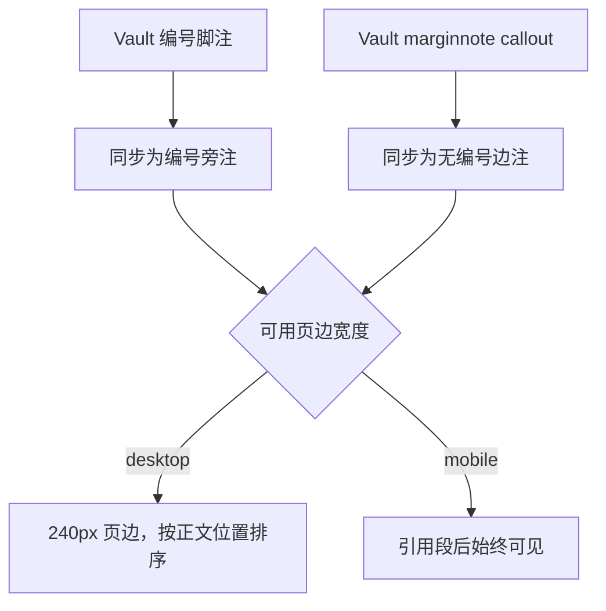
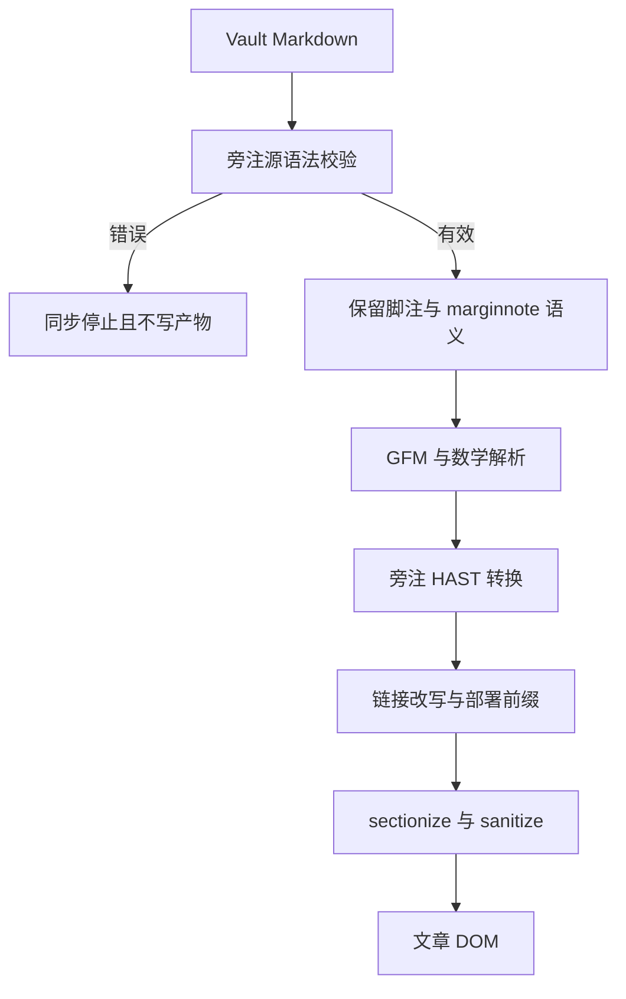
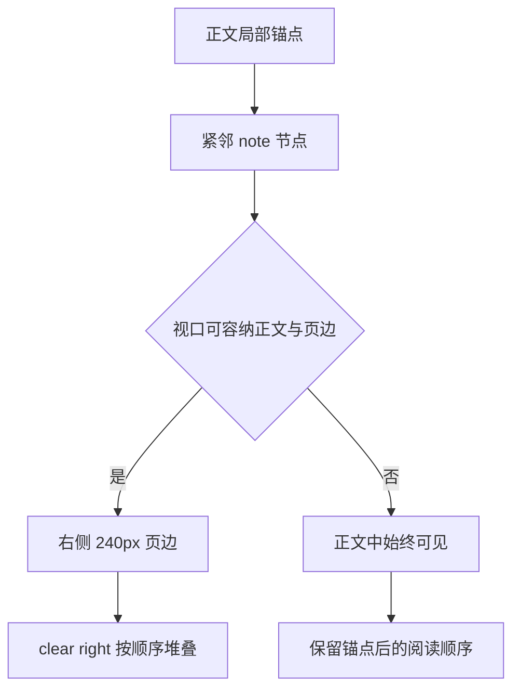

# Tufte Sidenotes - Plan

## Goal Capsule

- **目标：** 让作者能在 vault 中编写编号旁注与无编号边注，并让站点在桌面端使用现有页边、在移动端保持局部阅读顺序。
- **产品权限：** 本计划负责旁注语义、作者语法、响应式呈现、内容约束与试点。SVG 双主题迁移属于独立范围。
- **未解决阻塞项：** 无。

---

## Product Contract

### Summary

词条将支持两种作者主动编写的旁注。编号旁注精确对应正文位置；无编号边注承载短提醒。桌面端把两者放入 240px 页边，移动端把内容紧邻引用段回流并始终显示。

### Problem Frame

文章页面已经具有 680px 正文与 240px 页边，也已经定义 `.sidenote` 的桌面和窄屏样式，但全部 274 篇生成词条都没有旁注内容。现有同步管线会剥离所有 Obsidian callout 标记，也没有定义脚注到旁注的转换。

缺口位于内容模型与同步契约。要求作者手写 Tufte CSS 的 HTML 结构会绕过 vault 写作习惯，并与当前禁止原始 HTML 的 Markdown 管线冲突。

### Key Decisions

- **同时支持编号旁注与无编号边注** (session-settled: user-directed — chosen over 只支持一种类型: 分别覆盖精确对应与安静提醒)。Governs R1, R2, R3.
- **移动端始终显示** (session-settled: user-directed — chosen over 默认折叠与按类型折叠: 保留学习信息并消除交互状态)。Governs R9, R10, R11.
- **编号脚注与无编号 callout 分工** (session-settled: user-directed — chosen over 全部 callout 与自定义行内标记: 保留精确锚点与 Obsidian 原生可读性)。Governs R4, R5, R6.
- **第一版只允许短文、链接和行内数学** (session-settled: user-directed — chosen over 小图与任意 Markdown: 控制 240px 页边版式)。Governs R7, R8.
- **密度超限只产生 lint 警告** (session-settled: user-directed — chosen over 同步硬限制与纯文档约定: 保留合理例外并提供持续提醒)。Governs R14.
- **每个编号旁注只允许一个引用位置** (session-settled: user-directed — chosen over 多次引用: 避免页边定位和返回导航歧义)。Governs R5, R13.

### Requirements

**旁注语义**

- R1. 编号旁注必须与正文中的一个词、符号、句子或来源精确对应，并显示文章内自动递增的编号。
- R2. 无编号边注必须与紧邻的前一正文段落对应，并使用作者提供的短标签说明角色，例如“符号提醒”或“常见误读”。
- R3. 删除全部旁注后，正文定义、推导、论证、运行方法和结论必须保持完整。

**Vault 作者语法**

- R4. 编号旁注使用 Obsidian 可预览的 Markdown 脚注语法；脚注标记定义锚点，脚注定义提供旁注内容。
- R5. 一个脚注 ID 在第一版只能引用一次；缺失定义、重复定义或重复引用必须在同步写入产物前失败。
- R6. 无编号边注使用紧跟正文段落的 `marginnote` callout；callout 必须包含短标签和正文。

编号旁注的作者形态：

```markdown
欧几里得范数来自内积。[^inner-product-norm]

[^inner-product-norm]: 这条构造直接得到 2-范数；1-范数与无穷范数不能由标准内积按同一公式得到。
```

无编号边注的作者形态：

```markdown
范数下标指定距离规则。

> [!marginnote] 符号提醒
> 范数下标表示所用的尺子，不表示向量维数。
```

**内容范围**

- R7. 第一版旁注只允许纯文本、强调、站内或站外链接，以及行内数学。
- R8. 旁注中的展示公式、表格、代码块、图片、嵌套 callout 和多段块内容必须在同步写入产物前失败，并报告词条与旁注位置。

**响应式呈现与可访问性**

- R9. 视口足以容纳现有正文和页边布局时，旁注必须进入 240px 右侧页边，并与对应正文位置保持局部对齐。
- R10. 页边旁注必须保持文档顺序并避免互相覆盖；相邻旁注空间不足时按顺序向下堆叠，不得压住正文、插图或下一节标题。
- R11. 窄屏时，旁注必须紧邻对应正文段落回流为始终可见的内容块；第一版不显示折叠控件，不保存展开状态。
- R12. 编号锚点必须可由键盘与辅助技术识别，并能确定对应旁注；视觉顺序与语义阅读顺序不得互相矛盾。
- R13. 编号旁注与无编号边注必须使用不同的视觉标记；无编号边注不得占用编号序列。

**内容治理与试点**

- R14. 单篇超过 6 条旁注或单条超过约 120 个汉字时必须产生 lint 警告；警告不阻止同步。
- R15. 第一阶段只在一篇数学词条和一篇模型词条中试点；两个试点都必须同时包含编号旁注与无编号边注。
- R16. 第一阶段不得自动从括号、定义、相关词条或现有 blockquote 中生成旁注，也不得批量回填其余词条。
- R17. 试点必须在白色与黑色主题、桌面与移动端宽度下完成视觉验收，并保持站点现有测试与生产构建闸门全绿。

作者语义到响应式呈现的关系如下：



### Key Flows

- F1. 作者添加编号旁注
  - **触发条件：** 作者需要补充来源或精确解释某个词、符号或句子。
  - **步骤：** 在正文位置添加唯一脚注标记；在词条中添加对应脚注定义；同步流程校验 ID 与内容范围。
  - **结果：** 桌面端显示编号锚点和页边内容；移动端在引用段后显示同一编号与内容。
  - **覆盖：** R1, R3, R4, R5, R7, R8, R9, R10, R11, R12, R13, R17.
- F2. 作者添加无编号边注
  - **触发条件：** 作者需要补充符号提醒、前置知识、数值核对或常见误读。
  - **步骤：** 在对应段落后添加带标签的 `marginnote` callout；同步流程校验标签、邻接关系和内容范围。
  - **结果：** 桌面端显示无编号页边内容；移动端在该段后显示带标签内容块。
  - **覆盖：** R2, R3, R6, R7, R8, R9, R10, R11, R12, R13, R14, R17.
- F3. 旁注内容超出第一版能力
  - **触发条件：** 旁注包含不支持的块内容，或编号脚注 ID 关系无效。
  - **步骤：** 同步流程在写入任何生成产物前收集并报告错误。
  - **结果：** 事实源保留原状，站点不生成部分更新结果。
  - **覆盖：** R5, R8.

### Acceptance Examples

- AE1. 编号旁注响应式呈现
  - **覆盖：** R1, R4, R9, R10, R11, R12, R13.
  - **Given：** 一条有效编号脚注精确引用正文中的一句话。
  - **When：** 同一词条分别在桌面和移动端打开。
  - **Then：** 桌面端编号内容出现在对应页边；移动端内容紧邻该段且始终可见；两者编号一致。
- AE2. 无编号边注不占用编号
  - **覆盖：** R2, R6, R13.
  - **Given：** 两条编号旁注之间存在一个“符号提醒”边注。
  - **When：** 页面渲染。
  - **Then：** 编号序列连续；符号提醒显示独立标记与标签，但不产生脚注编号。
- AE3. 重复脚注引用
  - **覆盖：** R5.
  - **Given：** 同一个脚注 ID 在正文中出现两次。
  - **When：** 同步运行。
  - **Then：** 同步在写入生成产物前失败，并报告脚注 ID 与两个引用位置。
- AE4. 密度超出建议值
  - **覆盖：** R14.
  - **Given：** 一篇词条包含 7 条结构有效的短旁注。
  - **When：** 同步运行。
  - **Then：** 同步产生密度 lint 警告，但旁注仍可进入生成产物。
- AE5. 展示公式进入旁注
  - **覆盖：** R8.
  - **Given：** 一个 `marginnote` callout 包含展示数学块。
  - **When：** 同步运行。
  - **Then：** 同步在写入生成产物前失败，并报告不支持的内容类型与位置。

<!-- ce-section: work-relationships -->
### How This Work Fits Together

本计划负责 Tufte 旁注。以下关系是当前理解，不构成已承诺路线图。

- **可独立于：** 标准文本旁注不依赖 SVG 双主题迁移。
- **依赖：** 未来页边小图必须先满足独立的 SVG 双主题颜色契约。
- **共享：** 与 SVG 工作共用白色与黑色主题、桌面与移动端视觉验收方式。
- **支持：** 完成试点后，后续词条可在写作过程中逐篇添加旁注，无需一次性回填。

### Scope Boundaries

- 不包含页边小图、展示数学、表格、代码块和任意 Markdown 旁注。
- 不包含移动端折叠开关、展开状态和按旁注类型区分的交互。
- 不自动抽取或生成旁注，不批量回填现有词条。
- 不把必要定义、推导步骤、反例、运行输出或结论移入旁注。
- 不改变 680px 正文与 240px 页边的基本桌面布局。

### Dependencies and Assumptions

- vault 继续作为词条唯一事实源，`content-zh/` 继续作为纯同步产物。
- 现有词条没有 Markdown 脚注，新脚注语义不会覆盖旧内容。
- Markdown 管线继续禁止作者原始 HTML；旁注元素由同步或 AST 管线生成。
- 试点选择一篇数学词条和一篇模型词条，以覆盖行内数学、站内链接和不同正文密度。

### Sources and Research

- 项目证据、视觉样张结论和方案分析：`docs/research/2026-08-06-tufte-sidenotes-dark-svg.md`。
- 旁注意义与响应式参考：[Tufte CSS 官方示例](https://raw.githubusercontent.com/edwardtufte/tufte-css/gh-pages/index.html)。

---

## Planning Contract

### Product Contract Preservation

Product Contract unchanged.

### Key Technical Decisions

- KTD1. **同步前使用受限源语法解析器。** 编号脚注和 `marginnote` callout 在 wikilink 改写与普通 callout 降级前完成关系、邻接、内容类型和密度检查。解析器返回结构化错误与警告，并保持同步的先校验、后写入语义。该选择落实 R4-R8, R14。
- KTD2. **编号旁注复用 Astro 已启用的 GFM 脚注 AST。** 渲染插件移动标准脚注内容到引用位置，不引入原始 HTML或第三套作者标记；无编号边注继续由保留的 callout 标记转换。该选择落实 R1-R8, R12, R13。(session-settled: user-directed — chosen over 全部 callout 与自定义行内标记: 保留 Obsidian 可预览脚注和精确锚点)
- KTD3. **两套 Markdown 渲染入口共用同一插件与 sanitize 配置源。** Astro 构建和 `renderPageMarkdown` 测试辅助函数只保留各自的上下文参数，不复制旁注插件顺序、ARIA 白名单或 MathJax 白名单。该重构防止生产与测试渲染行为分叉。
- KTD4. **编号旁注保持行内锚点和局部内容顺序。** 编号内容在 AST 中紧跟对应引用并使用 `role="note"`；无编号边注保持为前一段后的独立 note。桌面只用 CSS 浮入右侧页边，窄屏在同一 DOM 位置回流；不使用复选框或 JavaScript。该选择落实 R9-R13。(session-settled: user-directed — chosen over 移动端折叠交互: 保留始终可见且无状态的阅读顺序)
- KTD5. **源校验与渲染校验分层负责。** 源校验拥有 ID 一致性、内容白名单、邻接和密度；渲染插件防御异常 AST 并拥有编号、ARIA、DOM 顺序和视觉类名。两层都显式失败，不做静默降级。
- KTD6. **试点只修改两篇 vault 词条。** 数学试点为《长度与距离》，模型试点为《MNIST + MLP 训练循环》；playground 只提供渲染 fixture。该选择落实 R15-R17，并保持 R16 的不回填边界。

### High-Level Technical Design

旁注从 vault 语法到浏览器只保留一条语义链路：



同一 DOM 顺序只由 CSS 决定进入页边还是正文：



### Sequencing

先锁定源语法和同步失败语义，再统一 Markdown 管线并实现 AST 转换。渲染结构稳定后调整响应式样式和 playground fixture。最后写入两篇 vault 试点并执行完整视觉矩阵。

### Risks and Dependencies

- Astro 的 GFM 脚注输出是编号旁注的输入契约。依赖升级时必须由渲染测试锁定引用属性、定义列表和编号顺序。
- 旁注插件需要移动脚注内容并移除尾部脚注区。任何未配对节点都必须使渲染失败，避免正文引用或补充内容静默丢失。
- `astro.config.mjs` 和 `src/pages/_render-page.mjs` 当前复制 Markdown 配置。KTD3 是旁注一致性的前置条件，不扩大到无关页面重构。
- 浮动布局可能使密集旁注跨越后续内容。CSS 验收必须覆盖同段多注、相邻段落和节尾堆叠。
- 两篇试点的源内容位于 vault。实施需要外部事实源写权限，并必须通过同步产生 repo 内内容。
- 共享 Markdown 配置会影响全部词条与 playground。实施前先锁定无旁注页面、普通 blockquote、MathJax、链接和 sectionize 的现有输出；任何非旁注差异都阻止迁移。
- 旁注没有持久状态或数据迁移。回退时先移除两篇 vault 试点语法，再撤销渲染插件与样式并运行同步；生成内容不得单独保留旁注标记。

### System-Wide Impact

- **作者边界：** vault 增加两种受限语法；普通脚注语义在本项目中固定为编号旁注，普通 callout 继续降级为 blockquote。
- **同步边界：** 旁注校验加入全词条原子写入前置阶段；密度警告沿用现有 LINT 通道，结构错误沿用 ERROR 通道。
- **渲染边界：** Astro 构建与测试辅助渲染共享同一插件顺序和 sanitize schema；旁注内链接、MathJax 与 base 前缀继续经过现有插件。
- **版式边界：** `.article-section` 的正文宽度和清除语义不变；旁注复用现有 240px 页边，并在窄屏保持同一 DOM 顺序。
- **可访问性边界：** 编号锚点、note 和返回关系成为稳定渲染契约；无编号边注使用标签而不进入编号序列。

---

## Implementation Units

### U1. 建立旁注源语法校验与同步边界

- **Goal:** 在任何产物写入前验证编号脚注、无编号边注、内容白名单和密度，并保留两类旁注意义供渲染。
- **Requirements:** R1-R8, R14, R16；F1-F3；AE3-AE5；KTD1, KTD5。
- **Dependencies:** 无。
- **Files:** `scripts/lib/sidenote-source.mjs`, `scripts/sync-from-vault.mjs`, `tests/unit/sidenote-source.test.mjs`。
- **Approach:**
  1. 按源行位置识别脚注引用、脚注定义和 `marginnote` callout，并返回可供同步合并的 errors、warnings 与转换后正文。
  2. 普通 callout 继续沿用现有降级规则；`marginnote` 在降级前分流并保留可识别标记。
  3. 编号脚注要求一个引用对应一个定义；无编号边注要求非空标签、单段正文和紧邻的前一正文段落。
  4. 内容白名单只接受文本、强调、链接和行内数学；密度按两类旁注总数和去除 Markdown 标记后的可见字符计算。
  5. 所有词条完成校验后才进入现有清理、复制和写入阶段。
- **Execution note:** 先为当前普通 callout 降级建立特征测试，再增加 `marginnote` 分流，避免改变既有引用块输出。
- **Patterns to follow:** `scripts/lib/copywriting-lint.mjs` 的纯结果结构；`scripts/sync-from-vault.mjs` 的统一错误收集和原子写入边界。
- **Test scenarios:**
  - 编号脚注包含文本、强调、链接和行内数学时通过，并保留引用与定义供 GFM 解析。
  - Covers AE3. 同一 ID 重复引用、缺失定义、重复定义或孤立定义时，分别报告 ID 与所有相关行并失败。
  - Covers AE5. 展示数学、表格、代码块、图片、嵌套 callout 或第二段内容进入任一旁注时，报告内容类型与位置并失败。
  - 有标签且紧邻段落的 `marginnote` 通过；缺失标签、位于标题或列表后、包含空段时失败。
  - Covers AE4. 第 7 条有效旁注和超过约 120 个可见汉字的单条旁注只产生 lint 警告，转换结果仍可写入。
  - 不含旁注的现有词条和普通 callout 保持当前输出。
  - 一个词条失败时，同步不更新任何 `content-zh/` 文件、章节 SVG 或 vault 索引。
- **Verification:** 纯解析测试覆盖全部合法与非法语法；同步集成测试证明错误汇总发生在写入边界之前。

### U2. 统一 Markdown 管线并生成可访问旁注节点

- **Goal:** 让生产构建和测试渲染以同一 AST 规则把脚注与 `marginnote` 转换为局部、可访问的 note 节点。
- **Requirements:** R1-R13, R17；F1-F3；AE1-AE3, AE5；KTD2-KTD5。
- **Dependencies:** U1。
- **Files:** `src/lib/markdown-pipeline.mjs`, `src/plugins/rehype-sidenotes.mjs`, `astro.config.mjs`, `src/pages/_render-page.mjs`, `tests/unit/rehype-sidenotes.test.mjs`, `tests/unit/render-page-structure.test.mjs`。
- **Approach:**
  1. 抽取两套渲染入口共同使用的 remark、rehype 与 sanitize 配置生成器，并保留构建专用高亮和章节上下文参数。
  2. 在 MathJax 之后、链接改写之前运行旁注插件，使旁注内的行内数学已结构化，旁注内链接仍可经过现有站内改写和 base 前缀。
  3. 把标准脚注引用与定义配对，将单段定义内容移动到引用后的行内 note，并移除已消费的尾部脚注区。
  4. 把保留的 `marginnote` blockquote 转为带标签的独立 note；普通 blockquote 保持不变。
  5. 扩展 sanitize 白名单以保留 note 的角色、ID、锚点、ARIA 关系和视觉类名；异常配对或不支持结构使渲染失败。
- **Execution note:** 先锁定 Astro 7.1 与 `@astrojs/markdown-remark` 7.2.1 当前 GFM 脚注 HAST，再实现转换；依赖升级不应改变测试契约。
- **Patterns to follow:** `src/plugins/rehype-rewrite-algebrica.mjs` 的单职责 HAST 遍历；`src/lib/base.mjs` 的单一配置源；现有 MathJax sanitize 扩展模式。
- **Test scenarios:**
  - Covers AE1. 一个脚注渲染为可聚焦编号锚点和紧邻 note；编号、href、ID、ARIA 和返回关系一致。
  - Covers AE2. 两个编号旁注之间的 `marginnote` 不占用编号，并保留作者标签。
  - 同一段内有两个不同脚注时，按引用顺序生成两个 note，桌面与移动使用同一 DOM 顺序。
  - 旁注内站内链接经过 rewrite 与 base 前缀；站外链接保留安全属性；行内数学经过 MathJax 且保持 inline。
  - 普通 blockquote、无旁注页面、尾随 MathJax style 和二级标题 sectionize 结构保持现状。
  - 脚注定义缺失、重复引用或包含多段 HAST 绕过源校验进入渲染时，插件显式失败。
  - sanitize 后 note 的 role、ARIA、ID 和类名保留，未授权原始 HTML 仍被剥离。
- **Verification:** 两个渲染入口对同一 fixture 产生相同旁注结构；现有 Markdown、MathJax、链接和 sectionize 测试无回归。

### U3. 完成桌面页边与移动回流样式

- **Goal:** 让两类旁注使用现有 240px 右侧页边，并在窄屏按 DOM 顺序始终显示。
- **Requirements:** R1-R3, R9-R13, R17；AE1, AE2；KTD4。
- **Dependencies:** U2。
- **Files:** `src/styles/site.css`, `playground/rendering.md`, `tests/unit/visual-contracts.test.mjs`, `tests/unit/render-page-structure.test.mjs`。
- **Approach:**
  1. 在现有 `.sidenote` 基础上区分编号旁注、无编号边注、锚点、标签和返回链接，不创建第二套页边布局。
  2. 宽屏继续使用 240px 浮动、`clear: right` 和分节清除；同段多注与相邻段落按文档顺序向下堆叠。
  3. 窄屏取消浮动并渲染为锚点后的块级内容；不隐藏内容，不显示 checkbox，不引入状态。
  4. 使用现有主题变量提供白色与黑色主题的文字、分隔线、背景和焦点状态。
  5. 在 playground 增加两类旁注、同段多注、行内数学、链接和长内容警戒样例。
- **Patterns to follow:** `src/styles/site.css` 现有 `.article-section .sidenote` 和 `@media (min-width: 1040px)` 规则；`playground/rendering.md` 的渲染回归 fixture。
- **Test scenarios:**
  - 桌面宽度下，编号旁注和无编号边注进入 240px 页边，正文宽度保持 680px，注释不覆盖正文或下一节标题。
  - 同一段两个编号旁注和下一段一个边注按引用顺序堆叠，编号连续。
  - 移动宽度下，两类旁注紧邻引用位置且始终可见，页面没有折叠控件和横向溢出。
  - 白色与黑色主题下，正文、标签、编号、边界和焦点轮廓均清晰。
  - 键盘可依次聚焦编号锚点与返回链接，视觉焦点不被浮动区域裁切。
- **Verification:** playground 的桌面、移动、白色和黑色矩阵通过；CSS 视觉契约锁定页边宽度、移动回流和无交互状态。

### U4. 写入两篇 vault 试点并锁定内容合同

- **Goal:** 在一篇数学词条和一篇模型词条中各加入两类旁注，证明作者体验和正文自足性。
- **Requirements:** R1-R17；F1, F2；AE1, AE2, AE4；KTD6。
- **Dependencies:** U3。
- **Files:** `content-zh/linear-algebra/lengths-and-distances.md`, `content-zh/training-nn/mnist-mlp-training-loop.md`, `tests/unit/sidenote-pilots.test.mjs`。
- **External source set:** vault `lengths-and-distances.md` 与 `mnist-mlp-training-loop.md`；repo 内两个文件只由同步生成。
- **Approach:**
  1. 每篇选择一个需要精确对应的补充作为编号旁注，并选择一个短标签提醒作为无编号边注。
  2. 数学试点覆盖行内数学和站内链接；模型试点覆盖术语提醒和来源或实现边界说明。
  3. 删除旁注后重新阅读全文，确认定义、推导、代码运行方法、证据和结论仍完整。
  4. 用内容合同测试锁定两篇都含两类旁注，但不把该规则扩展为全部词条必须有旁注。
- **Execution note:** 只在 vault 修改试点内容；同步后审查生成差异，禁止直接修补 `content-zh/`。
- **Patterns to follow:** 两篇现有 algebrica 长文结构；结尾 `## 相关词条` 约定；vault wikilink 和 callout 写作习惯。
- **Test scenarios:**
  - 两篇生成词条都包含至少一个唯一脚注引用和一个带标签 `marginnote`，并通过源语法校验。
  - 数学试点旁注的行内公式与站内链接正确渲染；模型试点的术语标签与编号顺序正确。
  - 临时移除两类旁注后，正文结构测试和人工阅读仍确认核心论证完整。
  - 两篇旁注数量和长度在建议范围内，不产生密度警告。
- **Verification:** 两篇试点通过同步、内容合同、渲染测试和四象限视觉验收；其余词条没有自动新增旁注。

### U5. 固化作者规范与完整验收

- **Goal:** 记录旁注写作边界、错误语义和视觉验收证据，并完成全站回归。
- **Requirements:** R3-R17；KTD1-KTD6。
- **Dependencies:** U4。
- **Files:** `docs/authoring/sidenotes.md`, `docs/qa/2026-08-06-sidenotes-review.md`, `README.md`, `PROJECT_MEMORY.md`。
- **Approach:** 作者文档说明两类语法、适用内容、禁止内容、密度警告和正文自足原则。QA 文档记录 playground 与两篇试点的主题和视口矩阵。项目记忆记录最终管线结构、验证证据和失败尝试。
- **Patterns to follow:** `CLAUDE.md` 的 vault 单向同步约定；`docs/runbooks/public-repository-cutover.md` 的显式证据边界。
- **Test scenarios:**
  - 写作者能依据文档选择编号旁注或无编号边注，并预判硬错误与 lint 警告。
  - QA 记录覆盖 playground、数学试点和模型试点的白色/黑色与桌面/移动组合。
  - 全站构建中不存在残留尾部脚注区、未转换 `marginnote` 标记或重复旁注 ID。
- **Verification:** 文档与实现一致；视觉记录完整；同步、测试和生产构建全部通过。

---

## Verification Contract

| Gate | Applies to | Required outcome |
|---|---|---|
| `npm run sync` | U1, U4, U5 | 旁注错误在任何生成写入前失败；密度超限只产生 lint 警告 |
| `npm test` | U1-U5 | 源语法、AST 转换、共享管线、响应式视觉契约和两篇试点合同全部通过 |
| `npm run build` | U2-U5 | 生产 Markdown 管线生成可访问旁注；postbuild 现有全站闸全部通过 |
| playground 视觉矩阵 | U3 | 两类旁注在白色/黑色与桌面/移动组合下通过布局和键盘验收 |
| 两篇试点视觉矩阵 | U4 | 《长度与距离》和《MNIST + MLP 训练循环》在四种组合下通过局部顺序和可读性验收 |
| DOM 与辅助技术检查 | U2-U4 | 编号锚点、note、返回关系、标签和阅读顺序一致；无编号边注不占编号 |

---

## Definition of Done

- Product Contract unchanged，所有 R/F/AE 均由 Implementation Units 与 Verification Contract 覆盖。
- U1-U5 的正常、边界、错误和集成场景都有可追溯验证结果。
- 两个 Markdown 渲染入口使用同一旁注插件顺序和 sanitize 配置源。
- 无效脚注关系和不支持内容在同步写入前失败；密度超限只警告。
- 两篇试点都包含编号旁注与无编号边注，且删除旁注后正文仍完整。
- 桌面页边、移动回流、白色主题、黑色主题和键盘阅读顺序全部通过验收。
- 其余词条没有自动回填，页面没有新增折叠状态或 JavaScript 旁注逻辑。
- `content-zh/` 只由 vault 同步生成，没有手工修补。
- `npm run sync`、`npm test` 和 `npm run build` 全部成功。
- 失败实验、临时标记和未采用的旁注转换代码不留在最终差异中。
- `PROJECT_MEMORY.md` 记录最终决策、验证证据、失败尝试和维护约定。
